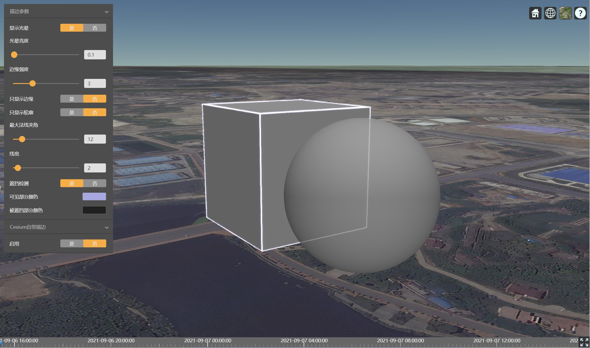
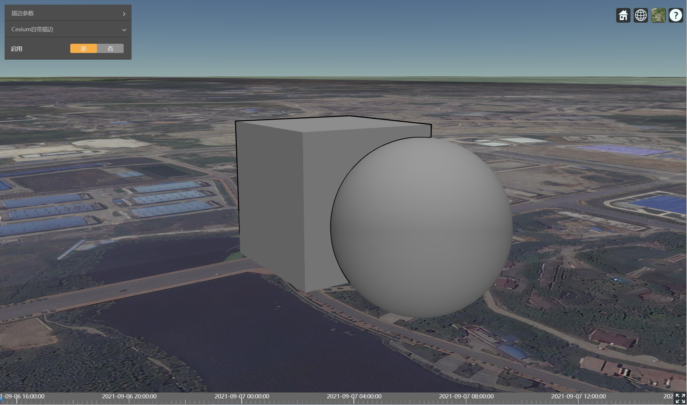
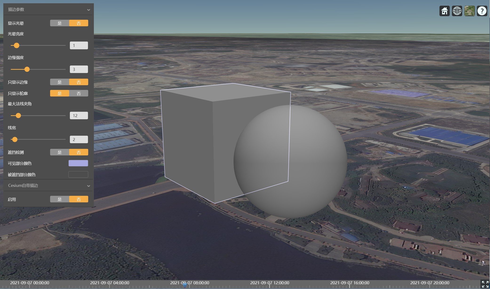
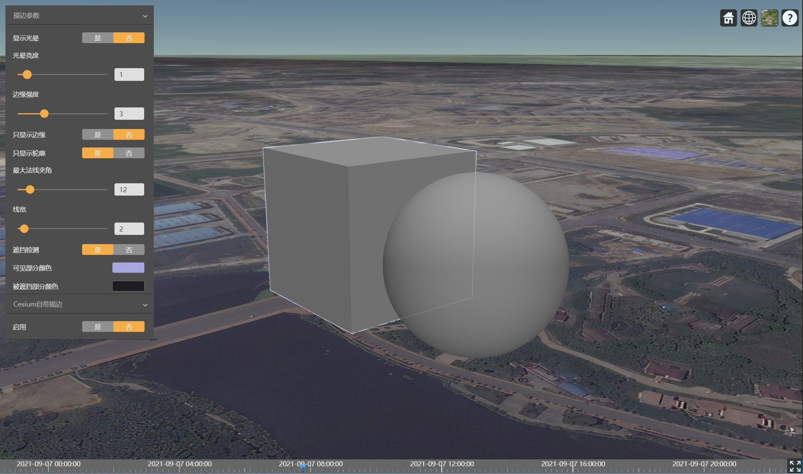

# Cesium实现更实用的3D描边效果

3D对象描边，常用于物体的高亮显示。本文将详细介绍如何在Cesium中实现该功能：提取物体完整的边缘，用不同颜色区分可见和被遮挡部分；根据法线夹角阈值提取平面边界；支持高亮显示Entity、Primitive和3DTiles等。（文末附源码）

## 1、前言

Cesium提供了Silhouette后期处理可以实现`3D对象描边`，但是描边结果并不能完全显示物体的轮廓，如图：



可以看出所描绘的轮廓存在如下不足：
* （1）无法提取被遮挡部分的轮廓；
* （2）未被遮挡部分的轮廓不完整。

熟悉`three.js`的小伙伴可能已经想起了`OutlinePass`的效果，今天我们就来将这个效果拿到Cesium中实现，不过我们要增加点难度，把THREE.EdgeGeometry的效果也拿过来，并且不修改几何体，实现更加实用的3D描边效果。

## 2、本文目标
Cesium后期处理中同时实现：
* （1）three.js OutlinePass的描边效果，即提取物体完整的边界，包括被遮挡的部分，同时可以选择用不同颜色区分可见和被遮挡部分；
* （2）three.js EdgeGeometry的描边效果，即根据法线夹角阈值提取平面边界。
* （3）支持高亮显示Cesium.Entity、Cesium.Primitive以及Cesium 3D Tiles要素。

## 3、关键技术
在开始实现本文目标效果之前，先介绍一下两个关键技术：
* （1）Cesium后期处理技术；
* （2）Cesium多次渲染技术

## 3.1、Cesium后期处理
我们先通过几段代码了解一下Cesium后期处理开发流程。

#### 3.1.1、创建一个基本的后期处理节点
创建一个后期处理节点的JavaScript代码如下：
```js
import singleStageFrag from './singleStage.frag'
var someValue=Cesium.Color.WHITE;
var singleStage = new Cesium.PostProcessStage({
    name: 'step1',
    uniforms:{
        constUniformVal:1,
        callbackUniformVal(){
            return someValue;
        }
    }
    fragmentShader: singleStageFrag
})
//将后期处理节点加入后期处理队列
viewer.postProcessStages.add(singleStage);
```
其中singleStage.frag为片段着色器代码文件（直接 import 是因为作者使用`Mesh-3D Engine`的命令行工具作为开发环境，服务端自动转成js文件并返回js代码），内容如下：
```glsl
//Cesium内置变量
uniform sampler2D colorTexture;
uniform vec2 colorTextureDimensions;
uniform sampler2D depthTexture;

varying vec2 v_textureCoordinates;

//自定义外部变量
uniform float constUniformVal;
uniform vec3 callbackUniformVal;

void main(){
    vec4 baseColor=texture2D(colorTexture,v_textureCoordinates);
    gl_FragColor=baseColor;
}
```
这个处理节点没有做任何加工处理，只是简单的复制场景。从中可以看出，一个基本的后期处理节点包含两大部分：

**(1) fragmentShader** 片段着色器代码：对每一帧的渲染结果进行加工处理。简单解释一下内置变量：
* `colorTexture` 整个场景的颜色纹理或者前一个后期处理结果颜色纹理；
* `colorTextureDimensions` 颜色纹理尺寸，x为宽度，y为高度；

>   *提示： Cesium会对每一个名为xxx、类型为Cesium.Texture的uniform变量都增加一个名为xxxDimensions的uniform变量。用来传递纹理尺寸。*
* `depthTexture` 整个场景的深度纹理或者前一个后期处理结果深度纹理；

**(2) uniforms** 向fragmentShader中传递外部数据。可传递的数据类型分为两大类：
* 常量类：布尔(`Boolean`),字符串(`String`),向量(`Cesium.CartesianX`)，矩阵(`Cesium.MatrixX`)
 
>*注意：字符串类型的uniform值可以是：图片路径；前续节点名称，用以访问节点的颜色纹理。*
* 回调函数：返回值类型同常量类。*在后续的文章中会用到这类uniform。*

#### 3.1.2、创建多个后处理节点
有些效果可能需要多次对场景进行加工、合成才能实现。Cesium提供PostProcessStageComposite类用来解决此类需求。示意代码如下：
```js
var step1=new Cesium.PostProcessStage({
    name:'step1',
    fragmentShader:`<step1_fs>`
})
var step2=new Cesium.PostProcessStage({
    name:'step2',
    fragmentShader:`step2_fs`
})
var step3=new Cesium.PostProcessStage({
    name:'step3',
    uniforms:{
        step1Texture:step1.name
    },
    fragmentShader:`step3_fs`
})
var steps12=new Cesium.PostProcessStageComposite({
    name:'steps',
    stages:[step1,step2,step3],
    inputPreviousStageTexture:true
})
```
参数`inputPreviousStageTexture`值解释:
* `true`：stages中各节点的colorTexture为其前一节点的颜色纹理；
* `false`：stages所有节点的colorTexture相同（不考虑uniforms中自定义colorTexture的情况）。
#### 3.1.3、设置选中对象
`Cesium`后期处理两个类都提供`selected`属性，用来生成选中对象id查询纹理。
`selected`接受的对象只有一个要求：包含`pickId`或者`pickIds`属性。凡是可以通过`Cesium.Scene` `pick`方法拾取到的对象，都可以找到对应的`pickId`，反过来，如果想要被pick到，也需要在创建DrawCommand的时候生成pickId。底层不同对象构建pickId的逻辑差别很大，导致获取pickId的方法也不尽相同。
* `Entity`和`Primitive` 从`picked.primitive._pickIds`查找;
* `3D Tiles要素` 已单体化的要素：`picked.pickId`；未单体化的瓦片：`picked.content._model._pickIds`;

## 3.2、Cesium多次渲染
后期处理技术允许我们对场景渲染结果进行加工处理，但是有些情况（比如SMAA、MSAA抗锯齿算法，以及接下来我们要实现的轮廓提取等），我们需要对场景全部或者部分对象进行临时修改、显隐控制并重新渲染。Cesium并没有提供现成的技术，所以我们需要动手去实现，这部分涉及Cesium底层渲染技术，这里不展开介绍，有必要的话可以专门写一篇来补充，这里列出接口定义和使用示例。

#### 3.2.1、实现功能
 在Cesium主渲染流程完成后，指定后期处理节点（stage）开始前，将选中的对象或者没有被选中的对象渲染到缓冲区，然后在该后期处理节点通过texture属性获取当前通道的颜色数据，通过depthTexture获取深度数据。
#### 3.2.2、接口定义（TypeScript）
```ts
class CesiumRenderPass {
    constructor(options: {
        name: string
        vertexShader?: string
        fragmentShader?: string
        shaderRedefine?:'add'|'replace'
        renderType?: 'all' | 'selected' | 'unselected'
        uniforms?: { [key: string]: any|(()=>any) }
        beforeUpdate?(scene: Cesium.Scene): void
        renderStateProcess?(renderState?: Cesium.RenderState): void
    })
    readonly texture: Cesium.Texture 
    readonly depthTexture: Cesium.Texture 
    stage: Cesium.PostProcessStage
    clear(context: Cesium.Context): void
    update(context: Cesium.Context): void
}
```
关键参数说明：
* `renderType` 设置需要渲染的对象：
>* *all*——当前渲染队列中的所有绘图命令
>* *selected*——渲染队列中被选中的对象关联的绘图命令，只过滤用整个对象内所有几何体的所有顶点pickId都相同的情况，
> 如果将pickId写入几何体的顶点则需要手动在shader中过滤（通过调用czm_selected()来判断是否为选中对象）
>* *unselected*——渲染队列中的所有未被选中的对象关联的绘图命令
* `stage` 设置绑定的后期处理节点。必须绑定后期处理节点，否则渲染通道将不会被调用执行渲染工作，也无法获取depthTexture和exture。
* `texture` 获取颜色纹理。请在uniform回调函数中获取，因为纹理在后期处理节点的update被调用时才会生成，提前获取不到。
* `depthTexture` 获取深度纹理。
* `shaderRedefine` 指定shader重定义方式，即指示在shader代码追加到绘图命令本身的shader之后，如何执行绘图逻辑：
> * *add*——并且调用原始的main函数，执行默认绘图逻辑，追加部分的绘图逻辑；
> * *replace*——不调用原始的main函数,只执行追加部分的绘图逻辑。
* `vertexShader` 追加的顶点着色器代码，可选。
* `fragmentShader` 追加的片元着色器代码，可选。

内置的预编译定义（在顶点和片元着色器中都可以访问）:
* `HAS_NORMAL` 指示顶点着色器中存在名为normal的属性。
* `HAS_V_NORMAL` 指示顶点属性中不存在为normal的属性，但存在名为v_normal的varying变量。
  
内置的函数`czm_selected`：识别当前像元是否为选中对象。
#### 3.2.3、使用示例
创建后期渲染通道
* 片段着色代码(renderPass.frag)：
```glsl
void main(){
    if(!czm_selected())discard;
}
```
* javascript代码：
```js
import maskPassFrag from './maskPass.frag'
 //1.创建后期渲染通道
const maskPass = new CesiumRenderPass({
    name:  'colorMask',
    fragmentShader:maskPassFrag
})
```
在后期处理节点中使用
* 片元着色器代码(readMaskPass.frag)：
```glsl
uniform sampler2D maskDepthTexture;
uniform sampler2D maskTexture;

varying vec2 v_textureCoordinates;
void main(void)
{  
    //读取颜色缓冲区数据
    vec4 color = texture2D(colorTexture, v_textureCoordinates);
    //按rgba读取深度缓冲区数据
    vec4 depthColor = texture2D(maskDepthTexture, v_textureCoordinates);
    //读取深度值
    float depth=czm_readDepth(maskDepthTexture, v_textureCoordinates);
    gl_FragColor =color;
}
```
* javascript代码：
```js
import readMaskPassFrag from './readMaskPass.frag'
const stage = new Cesium.PostProcessStage({
    name: name,
    uniforms: {
        maskTexture() {
            return maskPass.texture
        },
        maskDepthTexture() {
            return maskPass.depthTexture
        }
    },
    fragmentShader:readMaskPassFrag
})
//3.绑定后期处理节点
depthPass.stage = stage

//4.在cesium场景中使用
//设置选中对象，实际项目中可以通过监听鼠标点击事件pick到对象再赋值
stage.selected = [xxx];

viewer.postProcessStages.add(stage)
```

## 4、实现过程
准备这么久，终于到了正文了。实现过程整体分为以下几步：
>* （1）渲染整个场景，获得场景颜色和深度；
>* （2）渲染被选中对象，将法线保存到颜色纹理，同时得到该对象深度纹理；
>* （3）提取选中对象轮廓；
>* （4）将轮廓叠加到场景。

其中关键的步骤是（2）和（3），而（3）中的Shader代码几乎可以直接照搬three.js OutlinePass的代码，相对容易；（2）是比较困难，难点在于如何`只渲染被选中对象`，这就用到了上文介绍的`Cesium多次渲染技术`了。下面分步详细介绍。
#### 4.1、渲染整个场景
这一步在创建场景之后Cesium就一直进行，我们只需要创建好场景即可。
```js
let viewer=new Cesium.Viewer('cesiumContainer');
//添加Entity、3D Tiles等等
```
#### 4.2、渲染选中对象
这一步决定了我们实现的效果有别与Cesium自带的描边算法，因为边缘识别算法原理基本是一样的，差别在于输入的场景颜色和深度。

首先为提取外边界的做准备，片元着色器只需要通过czm_selected来判断是否为被选中对象（要素），如果不是则discard即可；其次我们还需要提取平面边界，即提取所有由近似处于同一平面的三角面组成的多边形边界，为此我们将法线保存到颜色纹理中。

顶点着色器如下（normalDepth.vert）：
```glsl
varying vec3 vOutlineNormal;
void main(){
    #ifdef HAS_NORMAL
        vOutlineNormal = normal;
    #else
        #ifdef HAS_V_NORMAL
            vOutlineNormal = v_normal;
        #else
            vOutlineNormal=vec3(0.);
        #endif
    #endif
}
```
片元着色器代码如下（normalDepth.frag）:
```glsl
varying vec3 vOutlineNormal;
void main(){
    if(!czm_selected())discard; 
    if(length(vOutlineNormal)>0.)gl_FragColor=vec4( vOutlineNormal ,gl_FragColor.a); 
}
```
创建`CesiumRenderPass`实例，这里不需要外部参数，JavaScript代码如下：
```js
import normalDepthVert from './normalDepth.vert'
import normalDepthFrag from './normalDepth.frag'
let normalDepthPass = new CesiumRenderPass({
    name: name + 'Pass',
    vertexShader: normalDepthVert,
    fragmentShader: normalDepthFrag
})
```
#### 4.3、提取选中对象轮廓
我们先来实现仅提取对象边缘的算法，不做遮挡检测，所有边缘使用同一颜色描绘。

这部分的shader代码直接取自 three.js  OutlinePass 的 getEdgeDetectionMaterial 函数，只对uniform做点处理。关键代码如下（singleEdgeColor.frag）：
```glsl
uniform sampler2D maskTexture;//4.2渲染结果颜色纹理
uniform float outlineWidth;//线宽
uniform vec3 visibleEdgeColor;//颜色

varying vec2 v_textureCoordinates;
void main(){
    vec2 vUv=v_textureCoordinates;
    vec2 invSize = outlineWidth / colorTextureDimensions;
    vec4 uvOffset = vec4(1.0, 0.0, 0.0, 1.0) * vec4(invSize, invSize);

    vec4 c1 = texture2D( maskTexture, vUv + uvOffset.xy);
    vec4 c2 = texture2D( maskTexture, vUv - uvOffset.xy);
    vec4 c3 = texture2D( maskTexture, vUv + uvOffset.yw);
    vec4 c4 = texture2D( maskTexture, vUv - uvOffset.yw);
  
    float diff1 = (c1.a - c2.a)*0.5;
    float diff2 = (c3.a - c4.a)*0.5;
    float d = length( vec2(diff1, diff2) );
 
    gl_FragColor = vec4(visibleEdgeColor, 1.0) * vec4(d);
}  
```
其中c1、c2、c3、c4为当前像元按线宽（outlineWidth）偏移一定像元之后采样到的颜色，颜色的r、g、b三通道保存的是选中对象的法线数据，a通道为场景透明度，a大于0则是选中对象内部，a为0表示选中对象外部。

关键的JavaScript代码如下：
```js
import singleEdgeColorFrag from './singleEdgeColor.frag'
const maskStage = new PostProcessStage({
    name: name + 'Mask',
    uniforms: {
        outlineWidth() {
            return outlineWidth;
        },
        visibleEdgeColor: function () {
            return visibleEdgeColor
        }, 
        maskTexture() {
            return normalDepthPass.texture
        },
        maskDepthTexture(){
            return normalDepthPass.depthTexture
        }
    },
    fragmentShader: singleEdgeColorFrag
})
```
`maskTexture`和`maskDepthTexture`分别是4.2处理结果的颜色和深度纹理。

效果如下图：

#### 4.4、轮廓遮挡检测
这部分和three.js OutlinePass有点区别，主要在深度读取和比较方法不同。关键的shader代码如下：
根据深度识别被遮挡部分：
```glsl
float dp1 = compareDepth( vUv + uvOffset.xy);
float dp2 = compareDepth( vUv - uvOffset.xy);
float dp3 = compareDepth( vUv + uvOffset.yw);
float dp4 = compareDepth( vUv - uvOffset.yw);

float a1 = min(dp1, dp2);
float a2 = min(dp3, dp4);
float visibilityFactor = min(a1, a2);
vec3 edgeColor = 1.0 - visibilityFactor > 0.001 ? visibleEdgeColor : hiddenEdgeColor;

gl_FragColor = vec4( edgeColor , 1. ) * vec4(d);
```
其中深度`compareDepth`定义如下：
```glsl
float compareDepth(const in vec2 uv){
    float maskDepth = czm_readDepth( maskDepthTexture, uv);
    float nonDepth = czm_readDepth( depthTexture, uv);
    return maskDepth>nonDepth?1.:0.;
}
```
`maskDepthTexture`为4.2渲染结果深度纹理。
效果如下图：

#### 4.5、提取平面边界
`THREE.EdgeGeometry`边缘提取的核心原理是：计算相邻两个三角面的法线夹角，如果夹角小于给定阈值则认为两者在同一平面，进而删除公共边。那么在shader中如何实现呢？前文已经做好了足够的准备了，我们只需要按照 4.2 和 4.3 比较深度和透明度的方法，再实现一个比较顶点法线的方法即可。核心shader代码如下：
```glsl
uniform float thresholdAngle;

float lengthSq(vec3 v){
    return v.x * v.x + v.y * v.y + v.z * v.z;
}

float normal_angleTo(vec3 a,vec3 b){
    float denominator =  sqrt(  lengthSq(a) * lengthSq(b) );
    if ( denominator == 0. ) return czm_pi / 2.;
    float theta = dot(a, b ) / denominator;
    return  acos(  clamp( theta, - 1., 1. ) );
}

float compareNormal(vec4 n1,vec4 n2){
    if(  abs (  normal_angleTo( n1.xyz , n2.xyz ) ) < thresholdAngle ){
        return 0.;
    }else{
        return 1.;
    }
}
```
其中 `thresholdAngle` 为相邻三角面法线夹角阈值，单位为弧度，通过uniform传入。

我们还需要对 `main` 函数进行修改，主要是4.2中 `d` 的计算，有变化：
```glsl
float diff1 = compareNormal(c1,c2)*0.5;
float diff2 = compareNormal(c3,c4)*0.5;
d = length( vec2(diff1, diff2) );
```
至此核心的步骤就全部完成了。想要得到上文的各个效果图，我们还需将得到的轮廓效果叠加到原始场景中。
#### 4.6、将轮廓叠加到场景
这里简单粗暴的将两张纹理贴图的颜色做加运算。
```glsl
uniform sampler2D colorTexture;
uniform sampler2D lineTexture;

varying vec2 v_textureCoordinates;
void main(){
    vec2 vUv =v_textureCoordinates;
    vec4 edgeColor=texture2D( lineTexture, vUv);
    vec4 color=texture2D( colorTexture, vUv); 
    gl_FragColor = color + edgeColor;
}
```
其中`lineTexture`为轮廓提取节点的颜色纹理，`colorTexture`为原始场景的颜色纹理。

### 6、应用示例
本文大体把实现流程的关键细节列出来，最后我们将这些细节封装，以便在项目中应用。再贴一下封装好的接口定义（createEdgeStage.js）：
```ts
class EdgePostProcessStage extends Cesium.PostProcessStage {  
  edgeOnly:boolean 
  showGlow:boolean 
  edgeGlow: number 
  edgeStrength: number 
  showOutlineOnly: boolean 
  thresholdAngle: number 
  outlineWidth: number 
  visibleEdgeColor: Cesium.Color 
  hiddenEdgeColor: Cesium.Color 
  useSingleColor: boolean
}
function createEdgeStage(name?: string): EdgePostProcessStage
```
#### 5.1、效果视频

<p>
    <video style="max-width:100%" id="video" controls="" preload="none" poster="图1.jpg">
        <source id="mp4" src="http://mpvideo.qpic.cn/0b78smaaaaaajiafltbwrjqvbe6dacjqaaaa.f10002.mp4?dis_k=163a8339688b97cfa188785c5cba3b88&dis_t=1631759429&vid=wxv_2036059485672210433&format_id=10002&support_redirect=0&mmversion=false" type="video/mp4">
    </video>
</p>

#### 5.2、示例代码
```js
import createEdgeStage from "./createEdgeStage";

var viewer = new Cesium.Viewer('cesiumContainer', {
    animation: false,
    selectionIndicator: false,
    geocoder: false
})
//entities
var box = viewer.entities.add({
    position: Cesium.Cartesian3.fromDegrees(106.647382019240, 26.620452464821, 50),
    box: {
        dimensions: new Cesium.Cartesian3(100, 100, 100),
        material: Cesium.Color.GREY
    }
})
viewer.entities.add({
    position: Cesium.Cartesian3.fromDegrees(106.647482019240, 26.621452464821, 50),
    ellipsoid: {
        radii: new Cesium.Cartesian3(50, 50, 50),
        material: Cesium.Color.GREY
    }
})

let ferrari = viewer.entities.add({
    position: Cesium.Cartesian3.fromDegrees(106.647382019240, 26.624152464821, 0),
    model: {
        uri: './ferrari.glb',
        scale: 50,
        runAnimations: true
    }
})
viewer.flyTo(ferrari)
viewer.homeButton.viewModel.command.beforeExecute.addEventListener(e => {
    viewer.flyTo(box)
    e.cancel = true
})

//鼠标点击，拾取对象并高亮显示
viewer.screenSpaceEventHandler.setInputAction((e) => {
    var mousePosition = e.position;
    var picked = viewer.scene.pick(mousePosition)

    edgeStage.selected = []
    edgeStage.enabled = false

    if (picked && picked.primitive) {
        let primitive = picked.primitive
        let pickIds = primitive._pickIds;//Entity、Primitive
        //已经单体化的3D Tiles或者其他pickObject本身带有pickId属性的情况
        let pickId = picked.pickId;
        //未单体化的3D Tiles
        if (!pickId && !pickIds && picked.content) {
            pickIds = picked.content._model._pickIds;
        }
        
        if (!pickId) {
            if (picked.id) {
                //Entity
                pickId = pickIds.find(pickId => {
                    return pickId.object == picked;
                })
            } else if (pickIds) {
                pickId = pickIds[0]
            }
        }

        if (pickId) {
            let pickObject = {
                pickId: pickId
            }
            edgeStage.selected = [pickObject]
            cesiumStage.selected = [pickObject]
            edgeStage.enabled = !cesiumStage.enabled
        }

        if (pickId) {
            let pickObject = {
                pickId: pickId
            }
            edgeStage.selected = [pickObject]
            cesiumStage.selected = [pickObject]
            edgeStage.enabled = !cesiumStage.enabled
        }

    }

}, Cesium.ScreenSpaceEventType.LEFT_CLICK)

//
var edgeStage = createEdgeStage()
edgeStage.visibleEdgeColor = Cesium.Color.fromCssColorString('#a8a8e0')
edgeStage.hiddenEdgeColor = Cesium.Color.fromCssColorString('#4d4d4d')
edgeStage.selected = []
edgeStage.enabled = false
viewer.postProcessStages.add(edgeStage);

var cesiumStage = Cesium.PostProcessStageLibrary.createSilhouetteStage()
cesiumStage.enabled = false;
viewer.postProcessStages.add(cesiumStage);
```

### 源码获取：关注微信公众号【三维网格3D】，回复‘3D描边’（不区分大小写） ###
