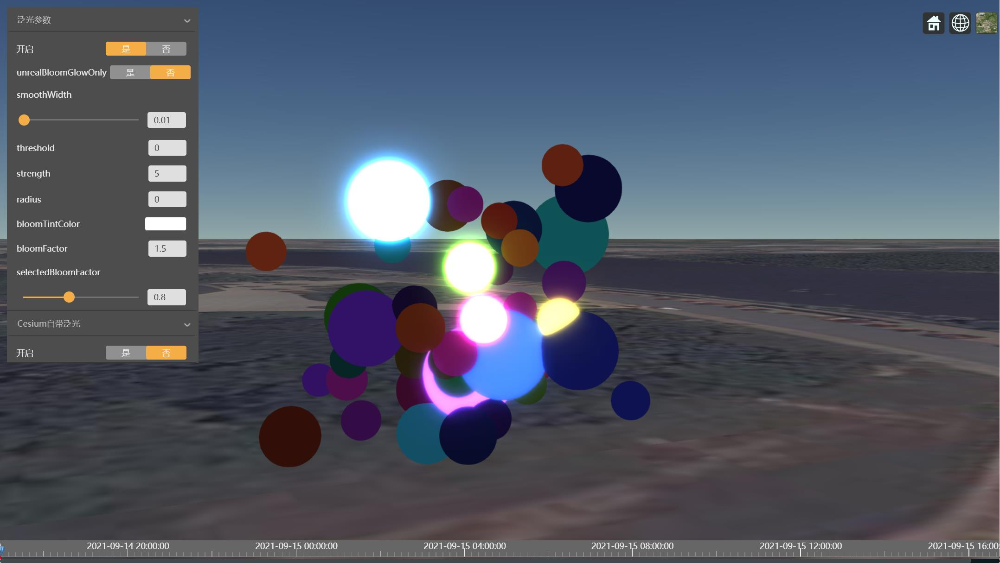
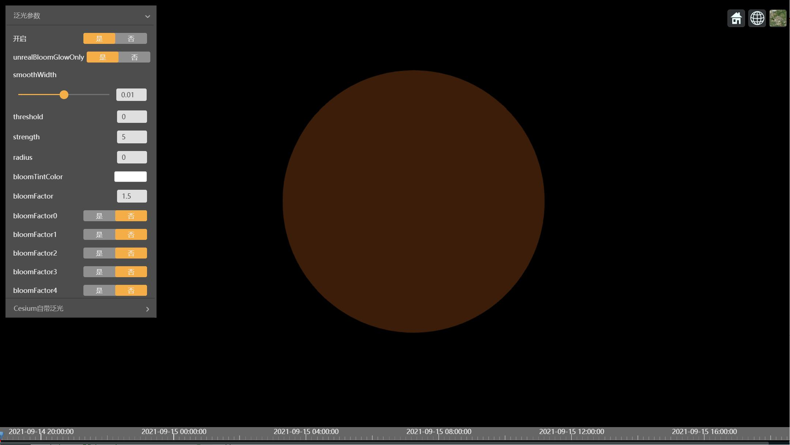
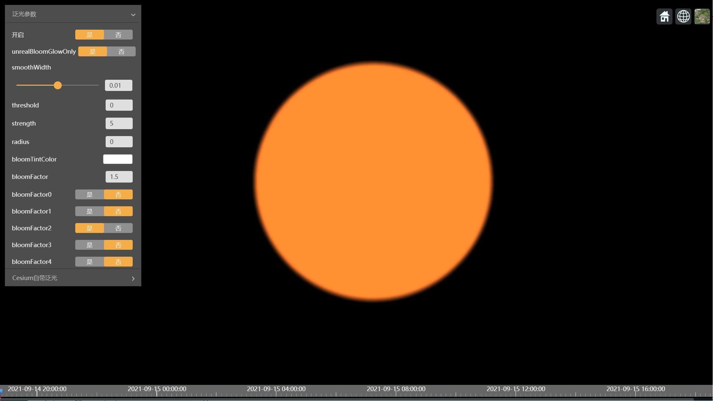
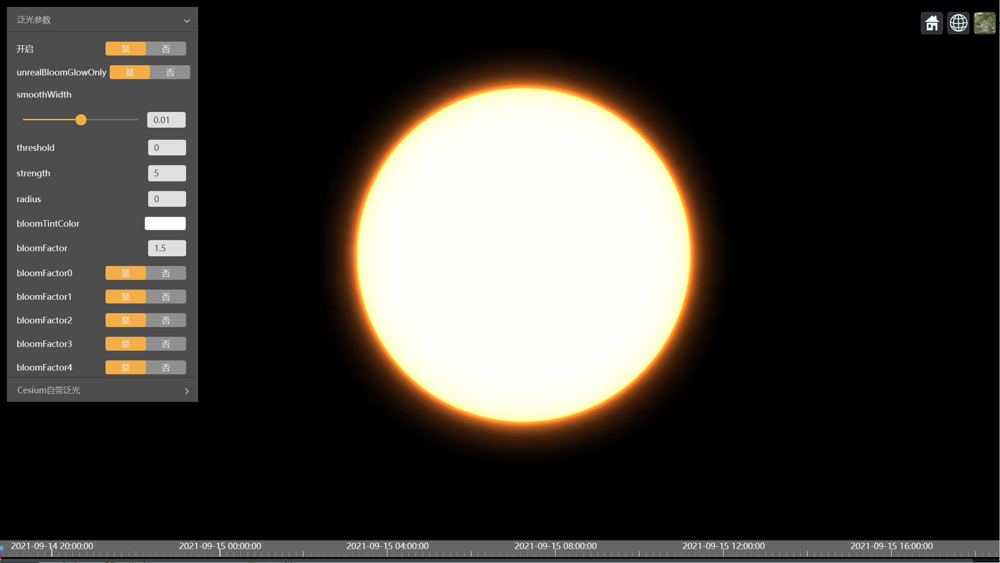

# Cesium实现UnrealBloom泛光效果
泛光（Bloom）是一种常用的后期处理特效，游戏中更是随处可见，这里直接上我们的效果图。

图1.UnrealBloom泛光效果

`Cesium`内置的`bloom`后期处理，是对全屏进行处理，还不能只针对选中的特定对象添加泛光效果，通过修改shader代码也可以实现。不过今天我们不做改进，而是引进`three.js`的`UnrealBloomPass`，在Cesium中实现一个新的泛光效果。
>*从`UnrealBloomPass`这个名字看，大概是说从Unreal Engine那里学来的吧，另外也是在名称上区别于辉光特效`BloomPass`，可以说`UnrealBloomPass`就是增强的辉光特效。感兴趣的可以看看[UE4关于泛光的文档页面](https://docs.unrealengine.com/4.27/zh-CN/RenderingAndGraphics/PostProcessEffects/Bloom/)*。

## 实现流程
泛光效果的技术并不复杂，大体分为三个步骤：
* **计算亮度**，获得亮度纹理；
* **高斯模糊**，对亮度纹理的根据不同分辨率和高斯核进行模糊处理，得到多个模糊纹理；
* **合并纹理**，将模糊纹理按照不同权重叠加到原始场景。

由于上一篇[《Cesium实现更实用的3D描边效果》](https://mp.weixin.qq.com/s/rrWPxm9BFSf_AFHWLEVQZw)已经详细介绍了Cesium后期处理技术并给出了基本示例，本文就只对`Shader`代码进行简单的注解，不贴出`JavaScript`部分的代码了。
## 计算亮度
亮度（Luminosity）的概念和计算方法可以参考维基百科词条[Luminosity](http://en.wikipedia.org/wiki/Luminosity)。

下面针对Cesium进行修改后的片元着色器(`fragmentShader`)代码:
```glsl
uniform sampler2D colorTexture;
uniform vec3 defaultColor;
uniform float defaultOpacity;
uniform float luminosityThreshold;
uniform float smoothWidth;

varying vec2 v_textureCoordinates;
void main() {
    vec4 texel = texture2D(colorTexture, v_textureCoordinates);

    #ifdef CZM_SELECTED_FEATURE
        if(!czm_selected()) {
            texel = vec4(0.);
        }
    #endif

    vec3 luma = vec3(0.299, 0.587, 0.114);
    float v = dot(texel.xyz, luma);
    vec4 outputColor = vec4(defaultColor.rgb, defaultOpacity);
    float alpha = smoothstep(luminosityThreshold, luminosityThreshold + smoothWidth, v);
    gl_FragColor = mix(outputColor, texel, alpha);
}
```
计算亮度的核心代码就是这两行：
```glsl
vec3 luma = vec3(0.299, 0.587, 0.114);
float v = dot(texel.xyz, luma);
```
`CZM_SELECTED_FEATURE`是由`Cesium`自动定义的命令，指示当前后期处理节点是否设置`selected`属性，和`czm_selected`一起用于判断是否为选中对象。
这一步的效果图如下：

图2.亮度计算效果图

`luminosityThreshold`和`smoothWidth`两个参数可以对亮度计算结果进行微调。

## 高斯模糊
接下来我们需要对亮度纹理进行多次处理，得到不同平滑程度和尺寸的模糊纹理。每次处理的流程如下：
* 设置高斯核半径`KERNEL_RADIUS`;
* 降低目标纹理分辨率（用纹理缩放倍数表示）；
* 对亮度纹理进行纵向、横向两次高斯模糊处理。

高斯模糊的原理网上有很多优秀文章可以学习，感兴趣可以自行搜索，兴许对这部分`Shader`代码会有更加深刻的理解。
下面这段代码实现一个方向的高斯模糊：
```glsl
varying vec2 v_textureCoordinates;
uniform sampler2D colorTexture;
uniform vec2 colorTextureDimensions;
uniform vec2 direction;

float gaussianPdf(in float x, in float sigma) {
    return 0.39894 * exp( -0.5 * x * x/( sigma * sigma))/sigma;
}
void main() {
    
    vec2 invSize = 1.0 / colorTextureDimensions;
    float fSigma = float(SIGMA);
    float weightSum = gaussianPdf(0.0, fSigma);
    vec3 diffuseSum = texture2D( colorTexture, v_textureCoordinates).rgb * weightSum;
    for( int i = 1; i < KERNEL_RADIUS; i ++ ) {
        float x = float(i);
        float w = gaussianPdf(x, fSigma);
        vec2 uvOffset = direction * invSize * x;
        vec3 sample1 = texture2D( colorTexture, v_textureCoordinates + uvOffset).rgb;
        vec3 sample2 = texture2D( colorTexture, v_textureCoordinates - uvOffset).rgb;
        diffuseSum += (sample1 + sample2) * w;
        weightSum += 2.0 * w;
    }
    gl_FragColor = vec4(diffuseSum/weightSum, 1.0);
}
```
`KERNEL_RADIUS`是高斯核半径，单位是像素，在创建`Cesium.PostProcessStage`时在添加。
本文实现的效果总的进行了5次模糊处理，高斯核半径分别为：3, 5, 7, 9, 11；纹理缩放倍数分别为：1,0.5,0.25,0.125,0.0625。

图3.第三次模糊效果

图4.第四次模糊效果

图5.第五次模糊效果
## 合并纹理
最后我们将五次模糊处理的结果，按不同权重和颜色进行叠加，并预留一些参数供应用时按需进行调整。
```glsl
varying vec2 v_textureCoordinates;
uniform sampler2D blurTexture1;
uniform sampler2D blurTexture2;
uniform sampler2D blurTexture3;
uniform sampler2D blurTexture4;
uniform sampler2D blurTexture5;
uniform sampler2D colorTexture;
uniform float bloomStrength;
uniform float bloomRadius;
uniform float bloomFactors[NUM_MIPS];
uniform vec3 bloomTintColors[NUM_MIPS];
uniform bool glowOnly;

float lerpBloomFactor(const in float factor) {
    float mirrorFactor = 1.2 - factor;
    return mix(factor, mirrorFactor, bloomRadius);
}

void main() {

    vec4 color = texture2D(colorTexture, v_textureCoordinates);
    vec4 bloomColor = bloomStrength * (
        lerpBloomFactor(bloomFactors[0]) * vec4(bloomTintColors[0], 1.) * texture2D(blurTexture1, v_textureCoordinates) +
        lerpBloomFactor(bloomFactors[1]) * vec4(bloomTintColors[1], 1.) * texture2D(blurTexture2, v_textureCoordinates) +
        lerpBloomFactor(bloomFactors[2]) * vec4(bloomTintColors[2], 1.) * texture2D(blurTexture3, v_textureCoordinates) +
        lerpBloomFactor(bloomFactors[3]) * vec4(bloomTintColors[3], 1.) * texture2D(blurTexture4, v_textureCoordinates) +
        lerpBloomFactor(bloomFactors[4]) * vec4(bloomTintColors[4], 1.) * texture2D(blurTexture5, v_textureCoordinates)
    );

    gl_FragColor = glowOnly ? bloomColor : bloomColor + color;
}
```

图6.全部模糊加权合成效果


图7.应用示例效果


### 欢迎关注微信公众号【三维网格3D】，第一时间获取最新文章 ###
