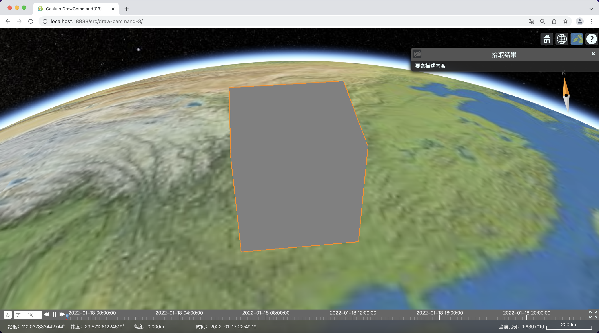
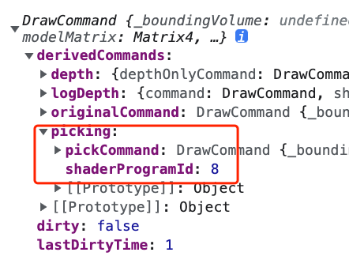

# Cesium 高性能扩展之DrawCommand（三）：显隐和点选
 
`DrawCommand` 是 Cesium 渲染器的核心类，常用的接口 `Entity`、`Primitive`、`Cesium3DTileSet`，以及地形和影像的渲染等等，底层都是一个个 `DrawCommand` 完成的。在进行扩展开发、视觉特效提升、性能优化、渲染到纹理（RTT），甚至基于 Cesium 封装自己的开发框架，定义独家数据格式等等，都需要开发人员对 `DrawCommand` 熟练掌握。而这部分接口，Cesium 官方文档没有公开，网上的相关资料也比较少，学习起来比较困难，所以接下来我们用几期文章，由浅入深，实用为主，力求全面地介绍 `DrawCommand` 及相关类的运用。

第一次被关注我们的小伙伴催更，还是挺开心的😂，公司事务略忙，只有深夜码字来赶稿了～那么本篇我们就按照计划往下写，介绍`自定义Primitive`的显隐控制，以及如何支持`scene.pick`，实现要素拾取查询。



### 1、显隐控制
从前面两篇的代码看，显隐控制是非常简单的，我们只需要在`update`方法的开头加入显隐判断，如果隐藏则直接退出，否则继续。
```JavaScript
//...
update(frameState) {
    if (!this.show) return;
    //...
}
//...
```

考虑一下，如果我们将多个要素的几何体合并成一个几何体，以达到减少绘图批次（`DrawCommand`的数量）提升性能的目的，这种情况下，上述方法将会同时显示或者隐藏这些要素，那么该如何控制其中任一要素的显隐呢？

参考`Cesium`的其他`Primitive`类，会发现他们为每一个顶点创建了一个`batchId`或者`a_batchId`属性，这个属性非常重要，除了可以用于控制显隐外，在`3D Tiles`样式引擎、要素拾取查询（`pick`）等都起到关键作用。

这里简单介绍基于`batchId`的显隐控制实现思路：
* 为每一个要素创建`batchId`，从0开始编号；
* 为要素几何体创建`batchId`顶点属性，并将`batchId`值逐个写入顶点属性数组；
* 合并所有要素几何体；
* 创建一个二维数组类型的纹理贴图，宽度等于要素数量，高度为1，用`0`和`1`表示要素隐藏或者显示，写入纹理数据；
* 在`shader`中根据`batchId`并计算uv，从显隐纹理获取要素的显隐标记，如果小于`1`则`discard`；
* 当某个要素显隐发生变化时，更新显隐纹理。

目前我们先不要想那么复杂，等掌握了更多技能，需要设计这么复杂的`自定义Primitve`的时候，自然能理解并参考`Cesium`的代码来实现这一显隐控制方法。

### 2、支持pick实现点选
要素拾取查询（`Pick`），是3D交互的重要基础，想象一下一个3D应用，所有图形要素怎么点击都没有反应，那它跟一个视频播放器就没有什么两样了～

`Cesium`提供了统一的要素拾取查询机制，拾取API封装在`Cesium.Scene`中，前面我们介绍`3D描边`等后期处理时就曾使用过，非常简单。
```JavaScript
 viewer.screenSpaceEventHandler.setInputAction(e => {
    var picked = viewer.scene.pick(e.position)
    if(picked){
        //...
    }
 })
```

那么如果让我们的`自定义Primitive`能够被`scene.pick`点击拾取到呢？

#### 2.1、context创建pickId
```JavaScript
/**
 * @param {Cesium.Context} context 
 */
createCommand(context) {
    /**
     * @type {Cesium.PickId}
     */
    var pickId = this.pickId;
    if (!pickId) {
        pickId = context.createPickId({
            primitive: this,
            description: '要素描述内容',
            //[key:string]:any
        });
        this.pickId = pickId
    }

    //
    var strPickId = 'czm_pickColor';
    var czm_pickColor = pickId.color;
    

    //...
}
```

#### 2.2、shader声明pickId变量
这里可以`pickId`变量类型有两种：`uniform`和`varying`。
* `uinform`：如果`DrawCommand`绘制的是单一要素，所绘制的内容就是一个整体，则使用`uniform`，所有顶点的pickId颜色是一样的，通过`uniformMap`来传递；
* `varying`：如果绘制的是多个要素，绘制内容可能分为多个部件，只是合并为一个批次来渲染，可能每个部件需要能够被单独点击拾取，则使用`varying`，需要将每一个部件要素的`pickId`颜色写入对应的几何顶点属性，顶点着色器接收颜色值，并通过`varying`传递到偏远着色器。

##### 2.2.1、uniform类pickId
```JavaScript
var fs = `
uniform vec3 color; 
//
uniform vec4 ${strPickId}; 
void main(){
    gl_FragColor=vec4( color , 1. );
}
`;
var shaderProgram = Cesium.ShaderProgram.fromCache({
    context: context,
    vertexShaderSource: vs,
    fragmentShaderSource: fs,
    attributeLocations: attributeLocations
})
```

##### 2.2.2、 varying类pickId

```JavaScript
var vs = `
attribute vec3 position;
//声明pickColor属性，接收顶点pickId颜色
attribute vec4 pickColor;
//
varying vec4 ${strPickId}; 
void main(){
    ${strPickId}=pickColor; 
    gl_Position = czm_projection  * czm_modelView * vec4( position , 1. );
}
`;
var fs = `
uniform vec3 color; 
//
varying vec4 ${strPickId}; 
void main(){
    gl_FragColor=vec4( color , 1. );
}
`;
var shaderProgram = Cesium.ShaderProgram.fromCache({
    context: context,
    vertexShaderSource: vs,
    fragmentShaderSource: fs,
    attributeLocations: attributeLocations
})
```

##### 2.2.3、Cesium对DrawCommand的后续加工
大家可能很好奇，为什么`pickId`变量，只是声明，却没有见到具体的使用，怎么能实现点击拾取呢？

这个问题，大家不妨在绘制出结果后（延迟一段时间）打印出`DrawCommand`对象看看：


我们接着展开看看`pickCommand._shaderProgram._vertexShaderText`：
```glsl
#ifdef GL_FRAGMENT_PRECISION_HIGH
    precision highp float;
#else
    precision mediump float;
    #define highp mediump
#endif

#define OES_texture_float_linear
#define OES_texture_float

#line 0
#line 0

uniform vec3 color; 
uniform vec4 czm_pickColor; 
void czm_non_pick_main(){
    gl_FragColor=vec4( color , 1. );
}
        
#line 0
void main() 
{ 
    czm_non_pick_main(); 
    if (gl_FragColor.a == 0.0) { 
        discard; 
    } 
    gl_FragColor = czm_pickColor; 
}
```

`Cesium`为`pick`操作创建了一个新的`DrawCommand`副本`pickCommand`，并且基于我们的`shader`进行加工处理，在新的`main函数`使用了我们声明的`pickId`变量。

同时大家可以看到，不止多了一个`pickCommand`，还增加了好几个其他`DrawCommand`副本，说明我们创建好的`DrawCommand`并没有直接进入渲染阶段，而是要经过`Cesium`渲染器进行加工处理，才最终交付执行渲染。

想一下，如果我们开启了阴影那么会不会又增加一个副本呢？这个问题我们留到下一篇来探讨。

#### 2.3、传递pickId颜色
与`2.2`节相对应，如果`pickId`变量为`uniform`类，则通过`unformMap`传递其颜色，如果为`varying`则需要修改几何体，增加`pickId`颜色相关的顶点属性。
##### 2.3.1、uniformMap传递
```JavaScript
 var uniformMap = {
    color() {
        return Cesium.Color.GRAY
    },
    //如果pickId为uniform类，则这里必须传递pickId颜色；为varying则可以去掉，不去掉也不影响使用
    [strPickId]() {
        return czm_pickColor;
    }
}
```

##### 2.3.2、顶点属性传递
这种情况下，`2.1`创建的`pickId`就不够用了，我们需要为每一个要素的几何体创建一个`pickId`。我们定一个方法，来处理每一个要素的几何体。
```JavaScript
/**
 * @param {object} feature 
 * @param {Cesium.Geometry} geometry
 * @param {Cesium.Context} context 
 */
setPickId(feature, geometry, context) {
    //创建pickId
    var pickId = context.createPickId({
        feature: feature,
        primitive: this
    })
    //保存pickId，用于后期处理、释放等
    this.pickIds.push(pickId);

    //增加几何顶点属性pickColor，这里属性名称和顶点着色器里面的对应attribute变量名称一致

    var ptCount = geometry.attributes.position.values.length / 3
    var pickColors = [], { red, green, blue, alpha } = pickId.color;
    for (let i = 0; i < ptCount; i++) {
        pickColors.push(red, green, blue, alpha)
    }
    pickColors = new Float32Array(pickColors);

    geometry.attributes.pickColor = new GeometryAttribute({
        componentDatatype: ComponentDatatype.FLOAT,
        componentsPerAttribute: 4,
        normalize: false,
        values: pickColors
    })
}
```

#### 2.4、drawCommand指定pickId变量名
```JavaScript
this.drawCommand = new Cesium.DrawCommand({
    modelMatrix: modelMatrix,
    vertexArray: va,
    shaderProgram: shaderProgram,
    uniformMap: uniformMap,
    renderState: renderState,
    pass: Cesium.Pass.OPAQUE,
    //
    pickId: strPickId
})
```

#### 2.5、释放pickId
需要注意，当我们不需要`pickId`或者`drawCommand`释放或者整个`Primitive`释放时，一定要`释放pickId`，否则将会出现内存泄漏，因为我们会将primitive对象绑定到pickId，这个pickId不释放的话，会一直保存在`context`的缓存里，直到整个程序消亡。

下面是完整的drawCommandd释放方法，包含了pickId的释放。
```JavaScript
destroy(){
    var drawCommand = this.drawCommand;
    if (drawCommand) {
        var va = drawCommand.vertexArray, sp = drawCommand.shaderProgram;
        if (!va.isDestroyed()) va.destroy();
        if (!sp.isDestroyed || !sp.isDestroyed()) {
            sp.destroy();
        }
        drawCommand.isDestroyed = function returnTrue() {
            return true
        };
        drawCommand.uniformMap = undefined;
        drawCommand.renderState = Cesium.RenderState.removeFromCache(drawCommand.renderState)
        this.drawCommand=null
    }
    //单个要素的pickId
    if(this.pickId){
        this.pickId.destroy()
        this.pickId=null
    }
    //多个要素的pickId
    if(this.pickIds){
        this.pickIds.forEach(pickId=>{
            pickId.destroy()
        })
        this.pickIds.length=0;
    }
}
```
### 3、点选示例及效果视频
```JavaScript
var origin = Cesium.Cartesian3.fromDegrees(106, 26, 250000)
var modelMatrix = Cesium.Transforms.eastNorthUpToFixedFrame(origin)
var primitive = new MyPrimitive(modelMatrix);
viewer.scene.primitives.add(primitive)

//拾取结果高亮
var edgedStage = createEdgeStage()
edgedStage.uniforms.useSingleColor = true;
edgedStage.visibleEdgeColor = Cesium.Color.DARKORANGE
viewer.postProcessStages.add(edgedStage)

//测试pick
viewer.screenSpaceEventHandler.setInputAction(e => {
    var picked = viewer.scene.pick(e.position)

    viewer.selectedEntity = undefined
    edgedStage.selected = [];

    if (picked && picked.primitive && picked.primitive instanceof MyPrimitive) {
        viewer.selectedEntity = new Cesium.Entity({
            name: "拾取结果",
            description: picked.description
        })
        edgedStage.selected = [picked.primitive]
    }

}, Cesium.ScreenSpaceEventType.LEFT_CLICK)
```
<p>
    <video style="max-width:100%" id="video" controls="" preload="none" poster="./drawCommand3.png">
        <source id="mp4" src="uniform.mp4" type="video/mp4">
    </video>
</p>


有没有发现，当我们加入`pickId`之后，不但点击拾取查询功能实现了，包括后期处理高亮也自然支持了，这是因为Cesium后期处理的要素选择也是基于`pickId`实现的。

> 本篇到此结束，如果觉得有用，不妨点赞+分享，让更多小伙伴一起来交流学习吧！
> 下一篇我们将介绍阴影（shadows）和实例化（instancing），敬请期待！

### 欢迎关注微信公众号【三维网格3D】，第一时间获取最新文章 ###
