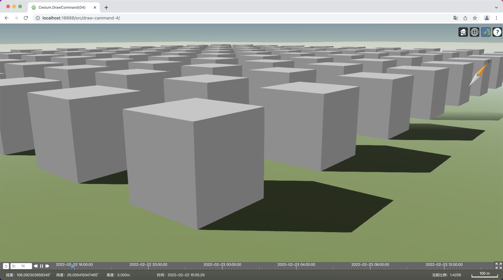
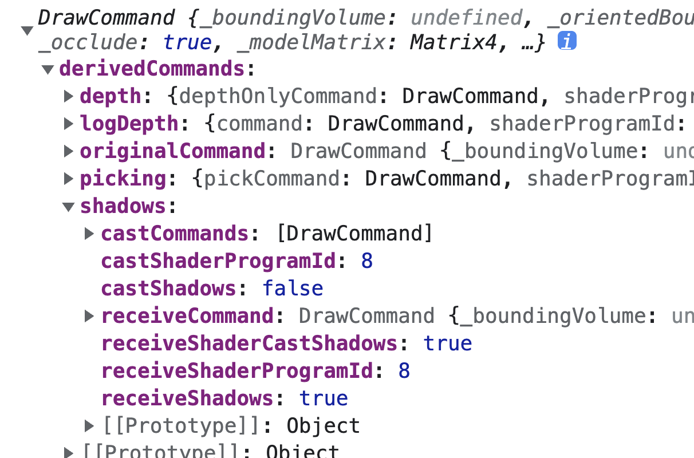
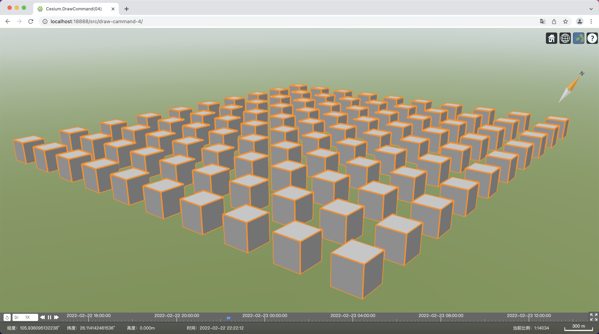
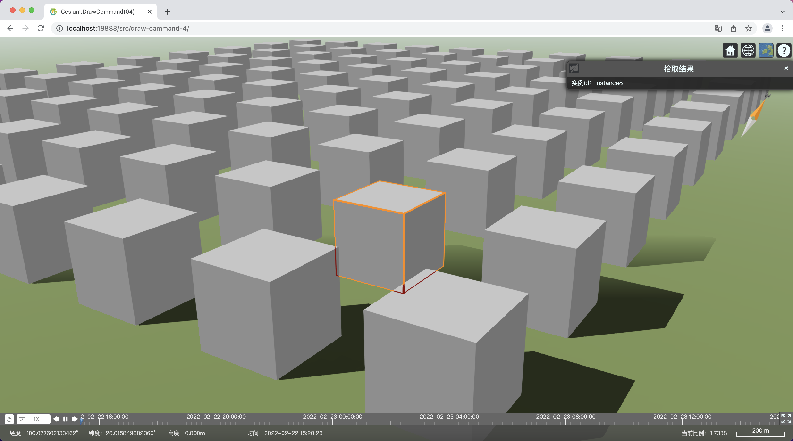

# Cesium 高性能扩展之 DrawCommand（四）：阴影和实例化

`DrawCommand` 是 Cesium 渲染器的核心类，常用的接口 `Entity`、`Primitive`、`Cesium3DTileSet`，以及地形和影像的渲染等等，底层都是一个个 `DrawCommand` 完成的。在进行扩展开发、视觉特效提升、性能优化、渲染到纹理（RTT），甚至基于 Cesium 封装自己的开发框架，定义独家数据格式等等，都需要开发人员对 `DrawCommand` 熟练掌握。而这部分接口，Cesium 官方文档没有公开，网上的相关资料也比较少，学习起来比较困难，所以接下来我们用几期文章，由浅入深，实用为主，力求全面地介绍 `DrawCommand` 及相关类的运用。

本篇我们来介绍如下内容：

- 支持 Cesium 内置阴影；
- 支持实例化：
  - DrawCommand 实例化关键属性；
  - 处理 modelMatrix；
  - 支持 pick 实例；


### 1、支持阴影

支持阴影的关键属性只有两个：

- `receiveShadows`——是否接收阴影；
- `castShadows`——是否投射阴影。

```JavaScript
//...
this.drawCommand = new Cesium.DrawCommand({
    //...
    receiveShadows: false,
    castShadows: true,
    //...
})
//...
```

开启阴影的效果：

此时，我们把`DrawCommand`打印出来看看：

可以看出，Cesium 自动为创建了至少两个`DrawCommand`副本，帮我们完成投射阴影和接收阴影的流程，我们只需要关注物体本身的渲染流程即可。

### 2、实例化

实例化渲染技术，适用于大量重复对象的渲染，可以减少渲染批次，提升性能。

下面我们基于前面几篇文章的示例来改造，仍然用一个`DrawCommand`实现，从绘制一个立方体变成绘制`100个`(当然可以更多，这个具体数量上限主要取决于被重复对象本身的数据量和浏览器环境的机器配置)立方体，通过这个示例来学习 Cesium 实例化渲染的关键技术。

我们看下最终使用时构造实例的代码：

```JavaScript
var instances = [];
for (let i = 0; i < 10; i++) {
    for (let j = 0; j < 10; j++) {
        var origin = Cesium.Cartesian3.fromDegrees(106 + 0.01 * i, 26 + 0.01 * j, 250)
        var modelMatrix = Cesium.Transforms.eastNorthUpToFixedFrame(origin)
        instances.push({
            id: 'instance' + i,
            color: Cesium.Color.fromRandom({ alpha: 255 }),
            matrix: modelMatrix
        })
    }
}

var primitive = new MyPrimitive(null, instances);
viewer.scene.primitives.add(primitive)
```

#### 2.1、关键属性

`DrawCommand`跟实例化直接相关的属性是`instanceCount`，当`instanceCount`大于`0`时，就启用实例化渲染。

```JavaScript
this.drawCommand = new Cesium.DrawCommand({
    modelMatrix: modelMatrix,
    vertexArray: va,
    shaderProgram: shaderProgram,
    uniformMap: uniformMap,
    renderState: renderState,
    pass: Cesium.Pass.OPAQUE,
    pickId: strPickId,
    receiveShadows: true,
    castShadows: true,
    //指定实例数量
    instanceCount: instanceCount
})
```

但是，要真正实现实例化渲染，最关键的还是构造`vertexArray`，至少需要处理每个实例的变换矩阵（modelMatrix），才能将相同的对象，渲染到三维场景的不同位置，否则 100 次重复绘制到同一个地方就没有多大意义了。

通过在`vertexArray`添加附加的实例化属性，允许各个实例的某个属性设置不同的值，比如颜色、pickId 等等。


下面我们分别介绍如何构造三个常用实例化属性：

- `modelMatrix`——设置每个实例的位置、旋转、缩放参数；
- `color`——设置每个实例（这里是每个立方体）的颜色；
- `pickColor`——设置每个实例的 pickId 颜色，使得每个实例都能单独被点击到。

#### 2.2、构造 VerteArrayAttribute

前面我们通过`Cesium.VertexArray.fromGeometry`来构造`VertexArray`，现在我们依然通过改方法来构造，但是多传递一个参数`vertexArrayAttributes`，来传递`Geometry.attributes`之外的附加属性。

```JavaScript
var vertextArrayAttributes=[{
    index: maxAttribLocation + 1,
    vertexBuffer: colorBuffer,
    componentsPerAttribute: 4,
    componentDatatype: Cesium.ComponentDatatype.FLOAT,
    normalize: false,
    offsetInBytes: 0,
    strideInBytes: componentSizeInBytes * 4,
    instanceDivisor: 1
}]

attributeLocations['color']=++maxAttribLocation;

var va = Cesium.VertexArray.fromGeometry({
    context: context,
    geometry: geometry,
    attributeLocations: attributeLocations,
    //这里传递除了`Geometry.attributes`之外的附加属性
    vertexArrayAttributes: vertexArrayAttributes
});
```

`VertexArrayAttribute`关键属性介绍：

- `index` 顶点属性索引；
- `vertexBuffer` 顶点属性缓冲区，可以存储多个顶点属性（`VertexArrayAttribute`）的数据；
- `componentsPerAttribute` 顶点属性类型向量维度，各个类型维度如下：
  - `float`——`1`维；
  - `vec2`——`2`维
  - `vec3`——`3`维；
  - `vec4`——`4`维；
- `componentDatatype` 类型为`Cesium.ComponentDatatype`，指定顶点属性类型向量每个分量的数据类型;
- `normalize` 顶点属性数据是否需要归一化；
- `offsetInBytes` 当`vertexBuffer`存储多个顶点属性的数据时候，在这里设置当前顶点属性在顶点缓冲区中的偏移量，单位为 byte，这个属性通过下面一节可以更好地理解；
- `strideInBytes` 当前顶点属性的每个顶点的数据占用的内存大小，单位为 byte；
- `instanceDivisor` 这个属性暂时不知道作何解释，实例化通常设置为 1，至于可不可以设置为 2，什么时候设置为 2，暂时还不知道如何作答。

#### 2.3、处理 modelMatrix

`shader`中`attribute`的数据类型维度最多为 4，也就是`vec4`，而`modelMatrix`是一个`4x4`矩阵，即`mat4`，因此我们需要四个`vec4`来传递一个`mat4`，分别传递`mat4`的 4 行。这里拆分后的四个属性通常是一个整体，所以我们构造 1 个顶点缓冲区（`vertexBuffer`）来存储 4 个顶点属性数据（实质上也还是一个，不过是拆分了而已）。

构造顶点缓冲区（`vertexBuffer`）的部分我们参考`Cesium.Model`的实例化代码。

```JavaScript
/**
 * @param {Cesium.Context} context 
 * @returns {Cesium.Buffer}
 */
createInstancedMatrixBuffer(context) {
    let instances = this.instances,
        instanceCount = instances.length,
        vertexSizeInFloats = 16,
        bufferData = new Float32Array(instanceCount * vertexSizeInFloats);

    for (let i = 0; i < instanceCount; i++) {
        const instance = instances[i],
            instanceMatrix = instance.matrix,
            offset = i * vertexSizeInFloats;

        //第一行
        bufferData[offset] = instanceMatrix[0]
        bufferData[offset + 1] = instanceMatrix[4]
        bufferData[offset + 2] = instanceMatrix[8]
        bufferData[offset + 3] = instanceMatrix[12]
        //第二行
        bufferData[offset + 4] = instanceMatrix[1]
        bufferData[offset + 5] = instanceMatrix[5]
        bufferData[offset + 6] = instanceMatrix[9]
        bufferData[offset + 7] = instanceMatrix[13]
        //第三行
        bufferData[offset + 8] = instanceMatrix[2]
        bufferData[offset + 9] = instanceMatrix[6]
        bufferData[offset + 10] = instanceMatrix[10]
        bufferData[offset + 11] = instanceMatrix[14]
        //第四行
        bufferData[offset + 12] = instanceMatrix[3]
        bufferData[offset + 13] = instanceMatrix[7]
        bufferData[offset + 14] = instanceMatrix[11]
        bufferData[offset + 15] = instanceMatrix[15]
    }

    let vertexBuffer = Cesium.Buffer.createVertexBuffer({
        context: context,
        typedArray: bufferData,
        usage: Cesium.BufferUsage.STATIC_DRAW
    });

    return vertexBuffer;
}
```
只设置这一个附加属性，便可以实现一个基本的实例化渲染程序了。
点选高亮后的效果如下：


这就实现了：一次性将100个相同的立方体，绘制到不同的空间位置。

但是不难发现，这100个立方体，是同时被点选或者取消点选的。接下来我们实现单个实例的点选。

#### 2.4、处理pickColor
为每个实例创建一个`pickId`，将所有`pickId`的颜色用一个顶点属性来传递。下面的代码，构造各个实例`pickId`的颜色缓冲区。
```JavaScript
/**
 * @param {Cesium.Context} context 
 * @returns {Cesium.Buffer}
 */
createInstancedPickColorBuffer(context) {
    let instances = this.instances,
        instanceCount = instances.length,
        vertexSizeInFloats = 4,
        bufferData = new Float32Array(instanceCount * vertexSizeInFloats);

    for (let i = 0; i < instanceCount; i++) {
        const instance = instances[i],
            instancePickId = context.createPickId({
                instance: instance,
                primitive: this,
                description: `实例id：${instance.id}`
            }),
            pickColor = instancePickId.color,
            offset = i * vertexSizeInFloats;
        instance.pickId = instancePickId

        bufferData[offset] = pickColor.red
        bufferData[offset + 1] = pickColor.green
        bufferData[offset + 2] = pickColor.blue
        bufferData[offset + 3] = pickColor.alpha
    }

    let vertexBuffer = Cesium.Buffer.createVertexBuffer({
        context: context,
        typedArray: bufferData,
        usage: Cesium.BufferUsage.STATIC_DRAW
    });

    return vertexBuffer;
}
```

效果如下：

 
#### 2.5、处理color
在创建实例时就为实例创建了一个颜色，结果各个立方体的颜色应该是不尽相同的。这里和`pickColor`的处理方法一样。

```JavaScript
/**
 * @param {Cesium.Context} context 
 * @returns {Cesium.Buffer}
 */
createInstancedColorBuffer(context) {
    let instances = this.instances,
        instanceCount = instances.length,
        vertexSizeInFloats = 4,
        bufferData = new Float32Array(instanceCount * vertexSizeInFloats);

    for (let i = 0; i < instanceCount; i++) {
        const instance = instances[i],
            instanceColor = instance.color,
            offset = i * vertexSizeInFloats;

        bufferData[offset] = instanceColor.red
        bufferData[offset + 1] = instanceColor.green
        bufferData[offset + 2] = instanceColor.blue
        bufferData[offset + 3] = instanceColor.alpha
    }

    let vertexBuffer = Cesium.Buffer.createVertexBuffer({
        context: context,
        typedArray: bufferData,
        usage: Cesium.BufferUsage.STATIC_DRAW
    });

    return vertexBuffer;
}
```
效果如下：


#### 2.6、构造VertexArray的完整代码
在createCommand方法里面调用前面处理附加顶点属性缓冲区的方法。
```JavaScript
/** 
 * @param {Cesium.Context} frameState 
 * @return {Cesium.DrawCommand} 
 */
createCommand(context) {
    //...

    var attributeLocations = Cesium.GeometryPipeline.createAttributeLocations(geometry)

    var maxAttribLocation = 0;
    for (var location in attributeLocations) {
        if (attributeLocations.hasOwnProperty(location)) {
            maxAttribLocation = Math.max(maxAttribLocation, attributeLocations[location])
        }
    }

    var instances = this.instances, instanceCount = instances.length;
    var matrixVertexSizeInFloats = 16;

    var modelMatrixBuffer = this.createInstancedMatrixBuffer(context);
    var pickColorBuffer = this.createInstancedPickColorBuffer(context);
    var colorBuffer = this.createInstancedColorBuffer(context);

    var componentSizeInBytes = Cesium.ComponentDatatype.getSizeInBytes(Cesium.ComponentDatatype.FLOAT);
    var instancedAttributes = {
        //接下来4个属性分别传递modelMatrix的4行
        modelMatrixRow0: {
            index: maxAttribLocation + 1,
            vertexBuffer: modelMatrixBuffer,
            componentsPerAttribute: 4,
            componentDatatype: Cesium.ComponentDatatype.FLOAT,
            normalize: false,
            offsetInBytes: 0,
            strideInBytes: componentSizeInBytes * matrixVertexSizeInFloats,
            instanceDivisor: 1
        },
        modelMatrixRow1: {
            index: maxAttribLocation + 2,
            vertexBuffer: modelMatrixBuffer,
            componentsPerAttribute: 4,
            componentDatatype: Cesium.ComponentDatatype.FLOAT,
            normalize: false,
            offsetInBytes: componentSizeInBytes * 4,
            strideInBytes: componentSizeInBytes * matrixVertexSizeInFloats,
            instanceDivisor: 1
        },
        modelMatrixRow2: {
            index: maxAttribLocation + 3,
            vertexBuffer: modelMatrixBuffer,
            componentsPerAttribute: 4,
            componentDatatype: Cesium.ComponentDatatype.FLOAT,
            normalize: false,
            offsetInBytes: componentSizeInBytes * 8,
            strideInBytes: componentSizeInBytes * matrixVertexSizeInFloats,
            instanceDivisor: 1
        },
        modelMatrixRow3: {
            index: maxAttribLocation + 4,
            vertexBuffer: modelMatrixBuffer,
            componentsPerAttribute: 4,
            componentDatatype: Cesium.ComponentDatatype.FLOAT,
            normalize: false,
            offsetInBytes: componentSizeInBytes * 12,
            strideInBytes: componentSizeInBytes * matrixVertexSizeInFloats,
            instanceDivisor: 1
        },
        //传递各个实例的颜色
        color: {
            index: maxAttribLocation + 5,
            vertexBuffer: colorBuffer,
            componentsPerAttribute: 4,
            componentDatatype: Cesium.ComponentDatatype.FLOAT,
            normalize: false,
            offsetInBytes: 0,
            strideInBytes: componentSizeInBytes * 4,
            instanceDivisor: 1
        },
        //传递各个实例的pickId，实现点选单个实例
        pickColor: {
            index: maxAttribLocation + 6,
            vertexBuffer: pickColorBuffer,
            componentsPerAttribute: 4,
            componentDatatype: Cesium.ComponentDatatype.FLOAT,
            normalize: false,
            offsetInBytes: 0,
            strideInBytes: componentSizeInBytes * 4,
            instanceDivisor: 1
        }
    };

    var vertexArrayAttributes = []
    for (var location in instancedAttributes) {
        if (instancedAttributes.hasOwnProperty(location)) {
            attributeLocations[location] = ++maxAttribLocation;
            vertexArrayAttributes.push(instancedAttributes[location])
        }
    }
    //

    var va = Cesium.VertexArray.fromGeometry({
        context: context,
        geometry: geometry,
        attributeLocations: attributeLocations,
        vertexArrayAttributes: vertexArrayAttributes
    });

//...
}
```

#### 2.7、完整shader代码
顶点着色器代码（vertexShader）
```glsl
attribute vec3 position;
attribute vec3 normal;

//用4个4维向量存储实例化模型变换矩阵
attribute vec4 modelMatrixRow0;
attribute vec4 modelMatrixRow1;
attribute vec4 modelMatrixRow2;
attribute vec4 modelMatrixRow3;
//声明pickColor属性，接收实例pickId颜色
attribute vec4 pickColor;
//声明pickColor属性，接收实例的颜色
attribute vec4 color;

varying vec3 v_normal;
varying vec4 v_color;
varying vec4 ${strPickId};

void main(){
    v_color=color;
    ${strPickId}=pickColor;
    //还原modelMatrix
    mat4 modelMatrix = mat4(
        modelMatrixRow0.x, modelMatrixRow1.x, modelMatrixRow2.x, modelMatrixRow3.x, 
        modelMatrixRow0.y, modelMatrixRow1.y, modelMatrixRow2.y, modelMatrixRow3.y, 
        modelMatrixRow0.z, modelMatrixRow1.z, modelMatrixRow2.z, modelMatrixRow3.z, 
        modelMatrixRow0.w, modelMatrixRow1.w, modelMatrixRow2.w, modelMatrixRow3.w
    );

    mat4 modelView = czm_view * modelMatrix ;
    mat3 normalMatrix = mat3(modelMatrix);
    v_normal = normalMatrix * normal;
 
    gl_Position = czm_projection  * modelView * vec4( position , 1. );
}
```

片元着色器代码（`fragmentShader`）：
```glsl
varying vec4 ${strPickId};
varying vec3 v_normal;
varying vec4 v_color;

void main(){
    gl_FragColor=vec4( v_color , 1. );
}
```

> 本篇到此结束，如果觉得有用，不妨点赞+分享，让更多小伙伴一起来交流学习吧！
> 下一篇我们将介绍如何支持 `Entity` 的贴地属性，以及如何解决抖动问题（`RTC`），敬请期待！

### 欢迎关注微信公众号【三维网格 3D】，第一时间获取最新文章


