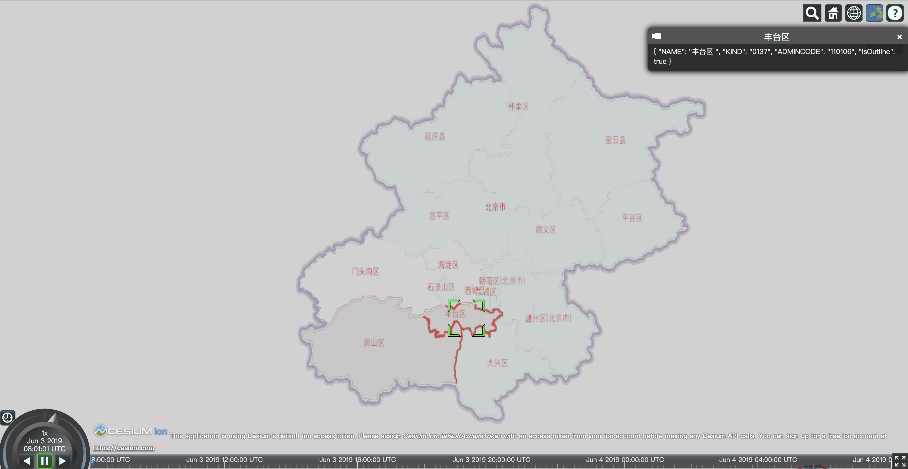

# Cesium矢量地图插件发布新版本
一周前`CesiumVectorTile` `1.2.1`版本就已经更新到`npm`里了，本次更新主要解决Cesium最新版本适配问题。
#### CesiumVectorTile简介
`CesiumVectorTile`是一个在Web前端二、三维地图框架上直接加载、显示矢量地图数据的开源插件，在三维地图上可以实现严格贴地。

这个插件是由贵州三维网格信息技术有限公司创始人在2017年创建的，2018年正式开源，现在由公司伙伴一起维护。

支持的地图框架：
* Leaflet
* Cesium

支持的矢量格式：
* geojson
* shp


图1.三维贴地显示效果


图2.样式设置效果(1)


图3.样式设置效果(2)
 
 #### 商用问题
插件源码在`github`和`npm`都可以获取，开箱即用，可放心商用。欢迎star（ https://github.com/MikesWei/CesiumVectorTile ）。
#### 安装
```shell
npm i cesiumvectortile
```
#### 使用
```javascript
 var provider=new Cesium.VectorTileImageryProvider({
    source: "xxx.geojson",//or "xxx.shp"
    defaultStyle: {
        outlineColor: "rgb(255,255,255)",
        lineWidth: 2,
        fill: false,
        tileCacheSize: 200
    },
    maximumLevel: 20,
    minimumLevel: 1
});
var layer=viewer.imageryLayers.addImageryProvider(provider);
```
#### 更新日志
##### 2021.09.08
* 1、解决新版Cesium移除isArray和loadXXX系列方法引发的问题；
* 2、解决其他已知的小问题。
##### 2020.04.15
* 1、增加TypeScript定义CesiumVectorTile.d.ts；
##### 2020.03.17
* 1、支持leaflet（仅支持EPSG4326）；
* 2、解决与第三方库（如Vue）结合的一些问题。
##### 2019.06.03
* 1、支持要素查询：增加构造函数可选参数allowPick，事件featuresPicked
##### 2018.07.15：
* 1、支持虚线和阴影
##### 2018.07.14：
* 1、支持最新版Cesium；
* 2、支持以注记的方式显示关键属性，如地名等。

### 欢迎关注微信公众号【三维网格3D】，第一时间获取最新文章 ###
