## Cesium+Three.js体验：优化BIM模型展示效果
前面我们介绍了5个Cesium和Three.js结合的方案（[《Cesium和Three.js结合的5个方案》](https://mp.weixin.qq.com/s?__biz=Mzg2MzY4NTMxNw==&mid=2247485171&idx=1&sn=f8931473c47b1cc858200ff7d9f39f51&chksm=ce759959f902104faafdbf91497da88623799ea6ca057d1413238fb2c35a223e068dbe6474ec&token=1431309887&lang=zh_CN#rd)），其中深度融合方案实现难度大，今天我们通过一次BIM模型展示效果调优过程，来窥探一下这个方案的具体优势。

### 1、实现过程
* BIM模型格式：`ifc`；
* 显示和调优工具：基于`Cesium+Three.js`实现的模型编辑工具。
* 代码量：`0`行。

#### 1.1、导入模型
* 点击【文件】->【导入本地模型】，然后选择ifc格式模型，完成模型导入；
* 在模型属性面板中调整模型位置。

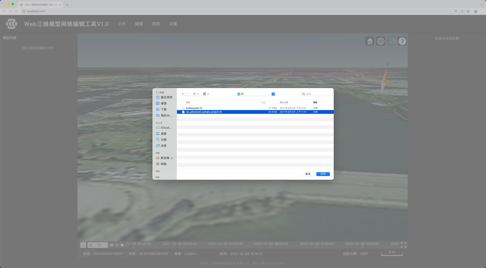
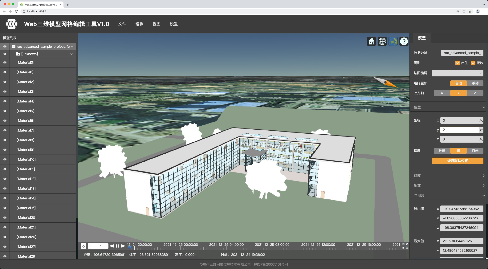

可以看出，模型比较平面，不够立体，尤其是树和建筑的拐角处，轮廓并不清晰。
#### 1.2、设置环境贴图
点击【设置】->【项目设置】，切换到项目属性设置面板。在【场景】标签页中找到【环境贴图】栏，点击【环境贴图】矩形区域，在弹出的窗口中选择环境贴图。

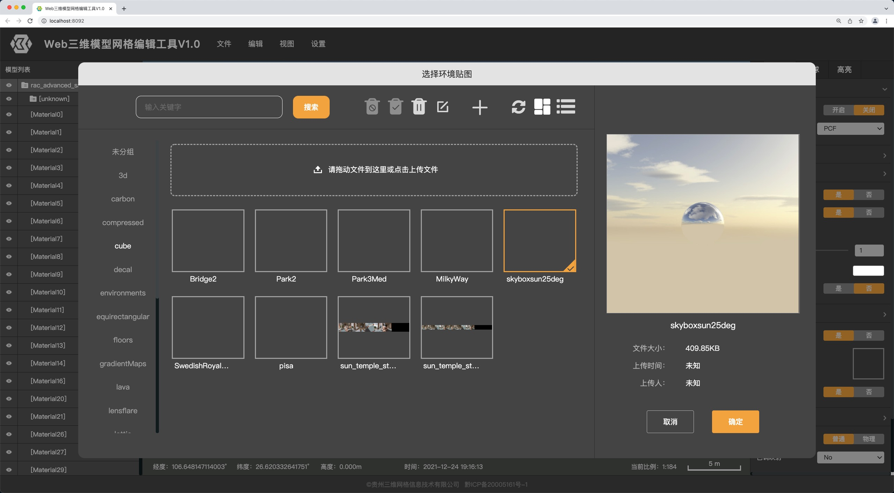
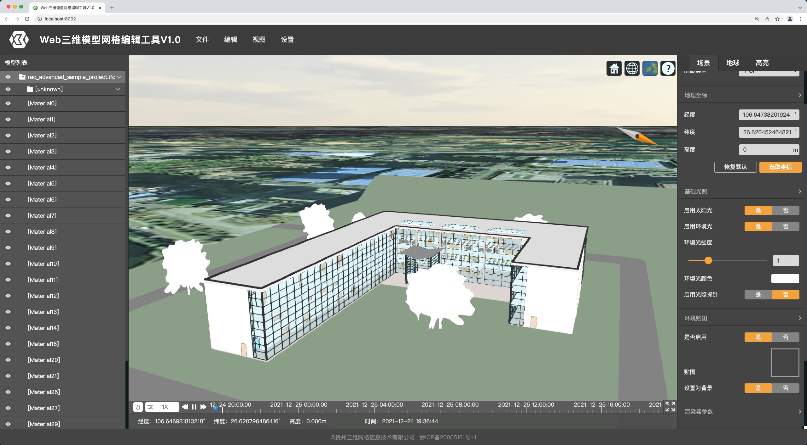

对比上一步，白色部分有些许变化，但是明暗对比度仍然不够。

#### 1.3、启用LightProbe
到目前，场景中有环境光和太阳光，这两种光照颜色和强度对于被照射的部分，都是基本一样的，所以亮部和暗部之间并没有过渡。可能是因为BIM模型材质类型并非Standard或者Physical，环境贴图没有起作用。

为改善这种状况，我启用LightProbe（我们工具用“光照探针”这个翻译）。操作很简单，在【场景】标签页中【基础光照】，将【光照探针】切换为【启用】。

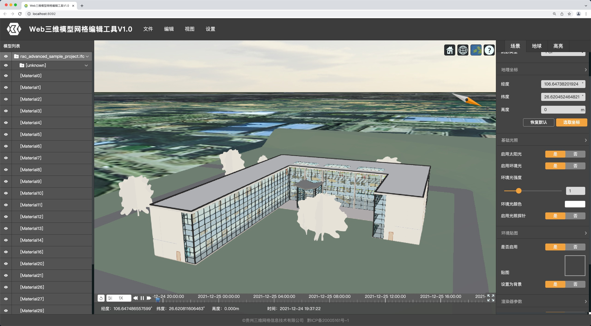
 
#### 1.4、调整太阳光
拖动时间轴，调整太阳的位置，看看阳光不同角度照射的效果。
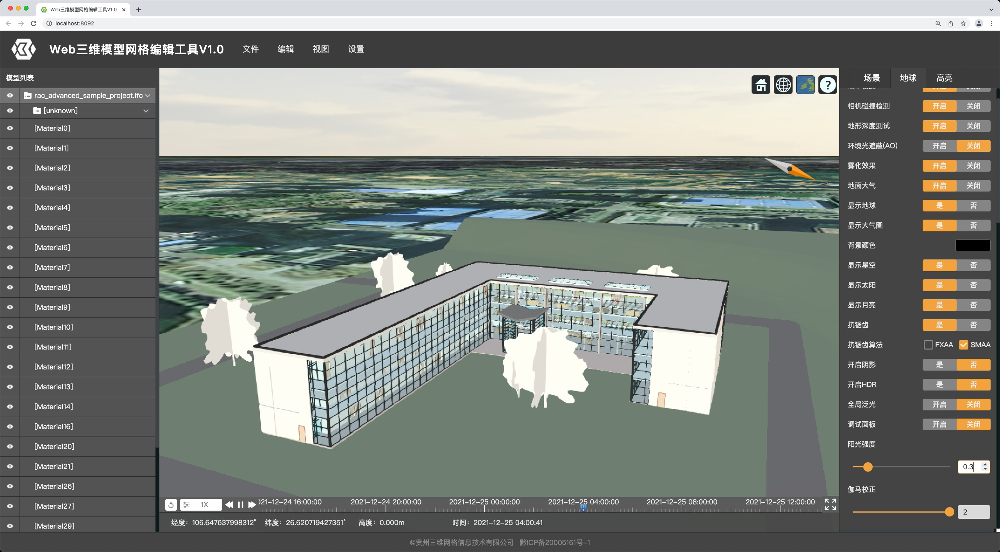
树的部分有很明显变化，其他部分也有细微的改进了。

#### 1.5、开启AO和抗锯齿
切换到【地球】标签页，将【环境光遮蔽(AO)】切换为【启用】，将【抗锯齿】切换为【是】。

可以发现，拐角处及附近的明暗对比、过渡得到了改善。

#### 1.6、调整AO参数
在【地球】标签页中找到【环境光遮蔽(AO)】栏，微调各个参数，直到得到比较满意的效果。
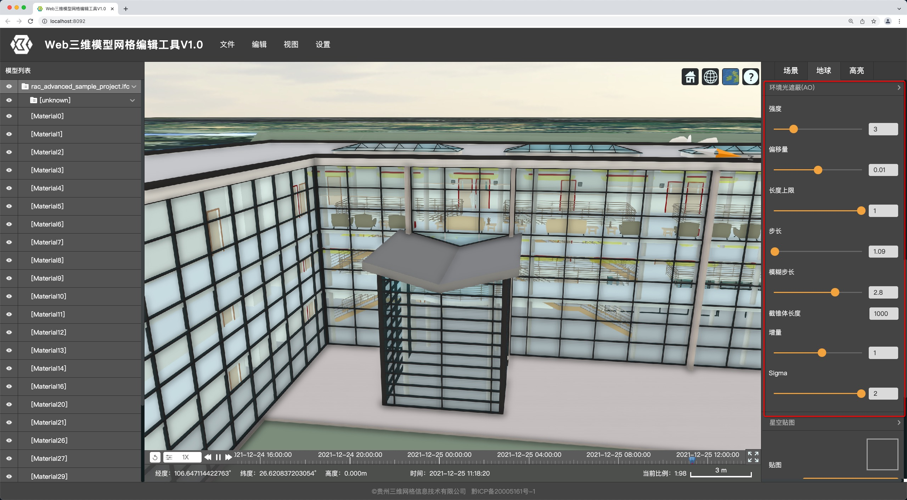

#### 2、优化效果
最后看从外到内，看一下优化结果吧。
##### 2.1、整体效果
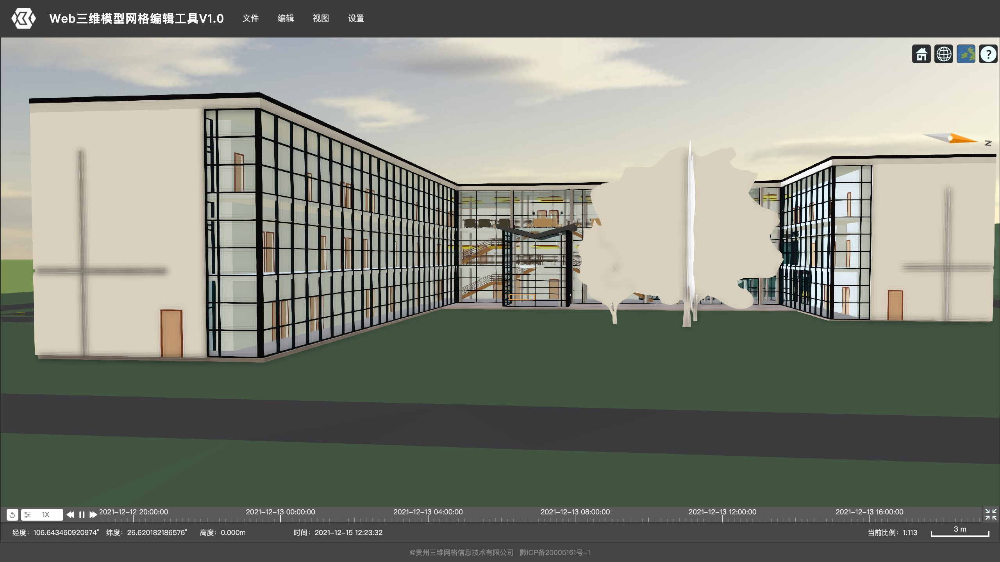
##### 2.2、室外效果
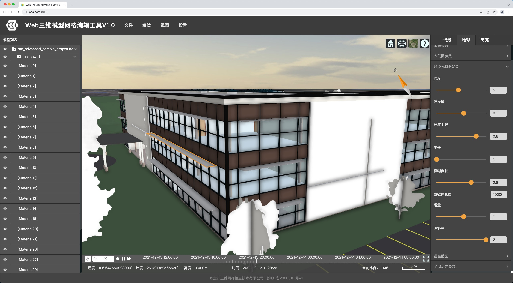
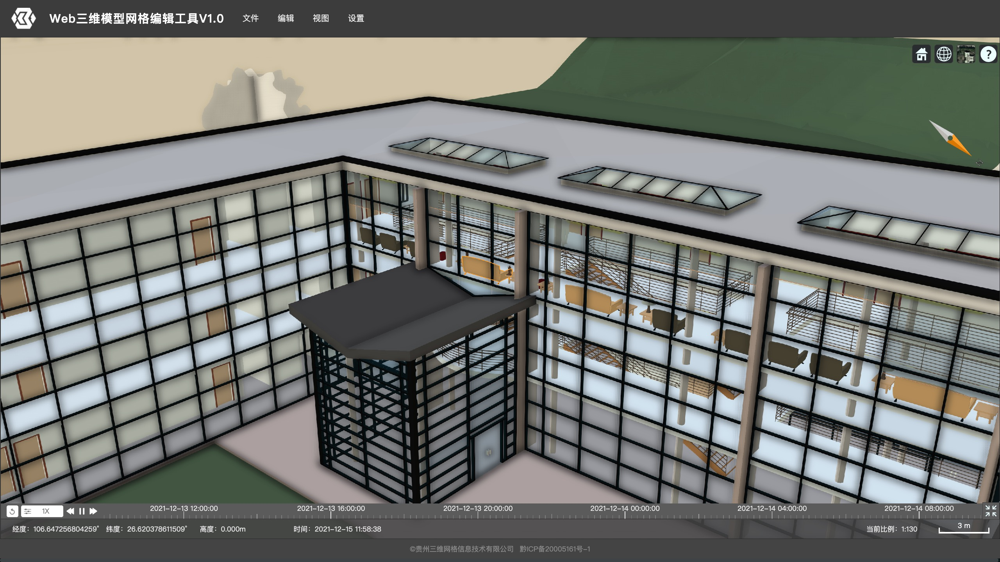
##### 2.3、室外细节
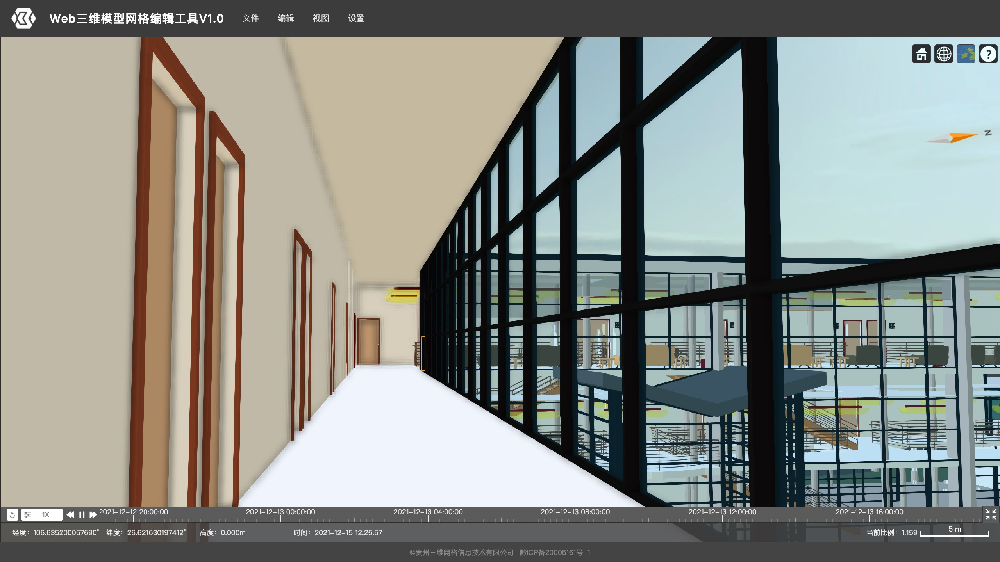
##### 2.4、室内细节
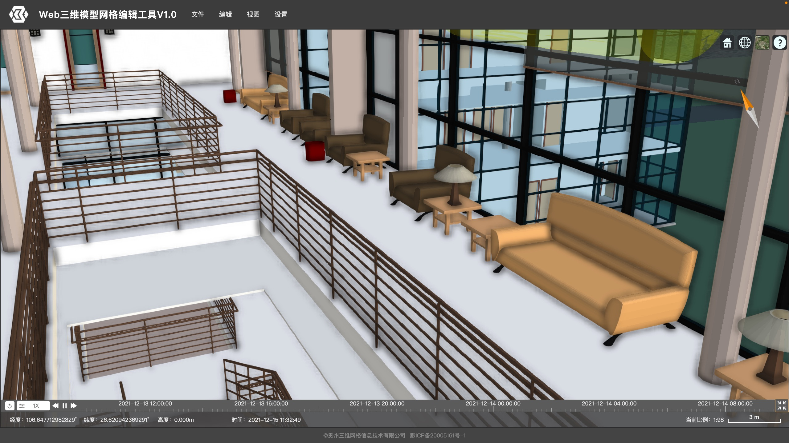
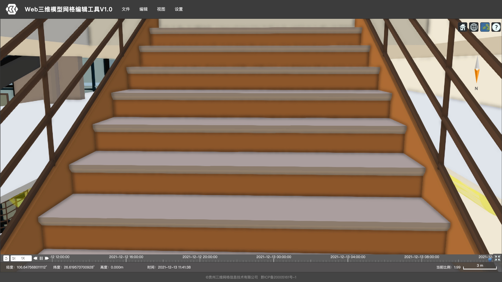
