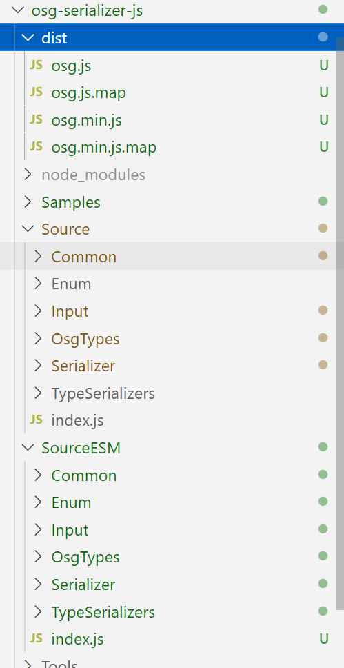
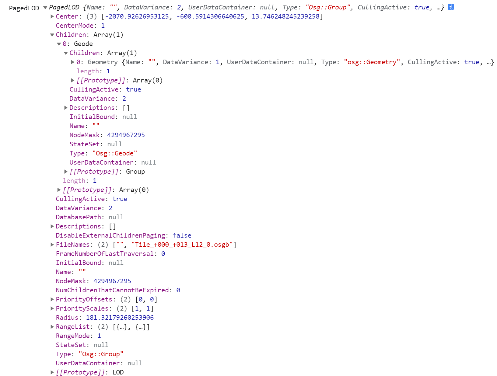
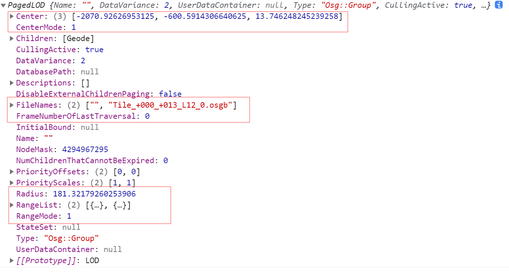
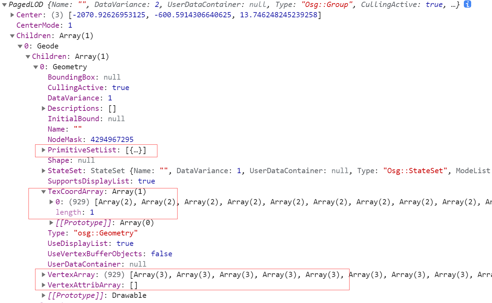
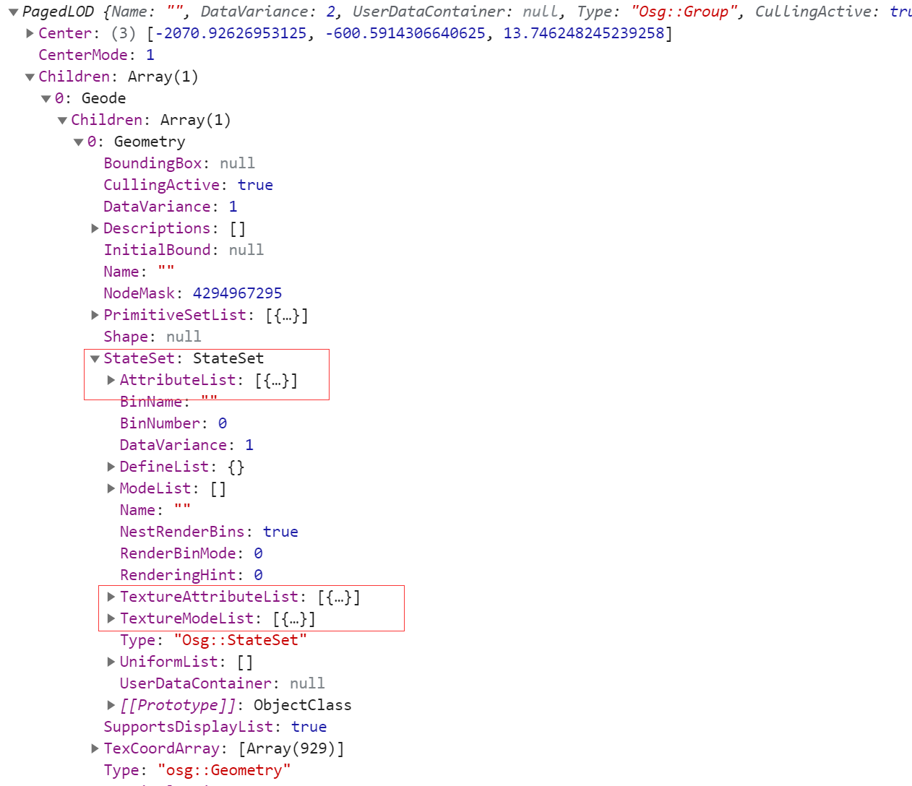
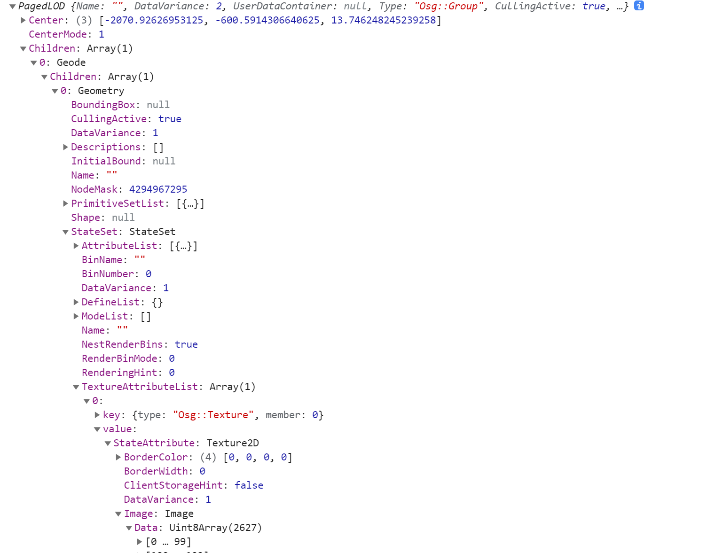

# 如何在Web上直接浏览大规模OSGB格式倾斜模型（一）：解析OSGB
今天是2021年国庆假期第二天，也是留守公司看大门的第二天，百忙之中抽空来开始写这一个系列吧！建议先收藏，等收假了再来翻阅~祝大家假期玩的开心！

### 前言
作为这个系列的开篇，先简单列个计划吧：
* （一）：解析OSGB
* （二）：转换OSGB
* （三）：实现PagedLOD

### 什么是OSGB？
`OSGB`全称为`Open Scene Gragh Binary`,是开源三维渲染引擎OpenSceneGraph（OSG）数据文件格式的二进制版本，同时也是目前倾斜摄影模型（尤其是使用CC处理的模型）常用的存储格式。

### 如何解析OSGB
由于OSG是用C++编写的，而且OSGB又是二进制格式，在解析上就存在一定的难度，如果完全从头编写解析程序的话，需要熟练掌握OSG，甚至需要深入源码，对Web开发者来说是一件不那么容易的事。

还好，有人造轮子了，在GitHub上找到一个开源项目：osg-serializer-js（https://github.com/eran-pinhas）。

### 改造osg-serializer-js
从简介看，我们也可以从npm上找到这个包，当我们试着直接拿来用，很快发现一个问题：
* 不能直接解析倾斜摄影模型文件，因为npm版本并不直接PagedLOD类型；

那我们从`GitHub`上直接`clone`下来试试看吧，很快又发现几个问题：
* 源码依赖`fs`、`path`、`assert`等`nodejs`环境特有的包，在Web上不能直接使用；
* 源码很多地方使用变量之前并未声明变量，在Web端使用会报错；

可能一些同学在发现npm包不能直接使用的时候就已经放弃了，毕竟这个包看起来就是为nodejs写的，而且作者也没有再更新过了。但是，如果不想放弃，似乎除了这个项目也没有别的选择了。

我们从几个方面来改造这个项目：
* 使用GitHub版的代码；
* 将`fs`、`path`等`nodejs`环境依赖项移到真正会在`nodejs`环境执行的代码片段的开头；
* 使用`assert`的地方改为`if`判断+`throw`抛出异常；
* 将用到`Buffer`的地方使用`buffer`包中的`Buffer`来适配浏览器环境；
* 排查使用变量之前并未声明变量的代码行，加上变量声明；
* 为方便与主流前端框架一起使用，将代码转为ES6语法，主要是导入导出部分，这块就又用上了我们团队的开发利器`@mesh-3d/cli`

###### 改造后的源码结构:


迫不及待地想看到结果了，下面我们通过两个示例来看看解析效果，并详细标出文件各个关键对象及其用途。
### 使用示例: 解析倾斜摄影OSGB文件
```js
import osg from 'osg-serializer-browser'
var filePath = './Samples/Tile_+000_+013.osgb'
fetch(filePath).then(res => { return res.arrayBuffer() }).then(abuf => {
    var osgObj = osg.readBuffer(abuf, filePath)
    console.log(`PagedLOD`,osgObj);
})
```
##### 倾斜摄影OSGB文件核心对象：PagedLOD

##### LOD参数

##### 几何数据

##### 材质参数

##### 纹理贴图数据


### 后语
知道大家忙，也讨厌重复别人的创作😀，我们已经准备了改造好的代码，
###### 关注公众号【三维网格3D】，后台回复【解析OSGB】，获取源码链接。

写到这里，似乎后面两篇都没有什么必要了😂

不过还是会继续写的，敬请期待！


### 欢迎关注微信公众号【三维网格3D】，第一时间获取最新文章 ###
