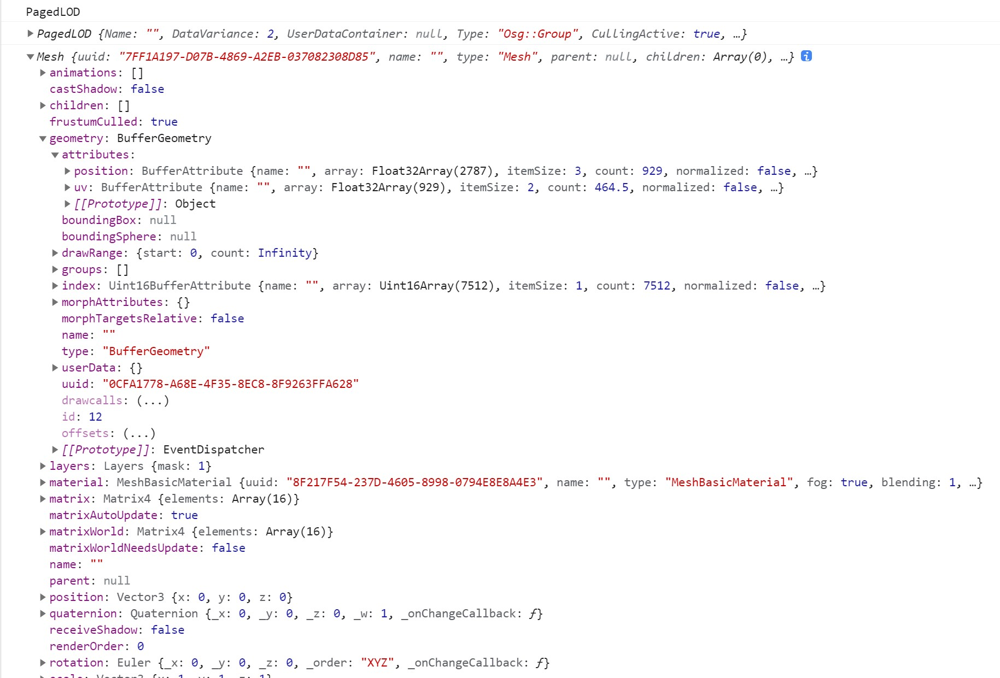
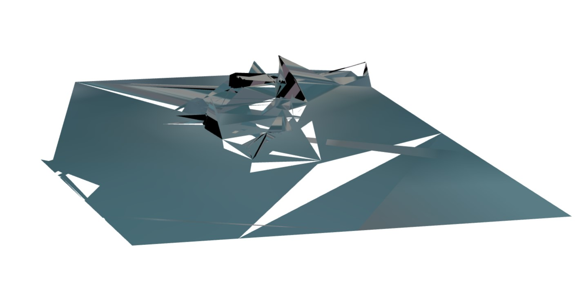

# 如何在Web上直接浏览大规模OSGB格式倾斜模型（二）：转换OSGB
上一篇（[如何在Web上直接浏览大规模OSGB格式倾斜模型（一）：解析OSGB](https://mp.weixin.qq.com/s/jq3kDIuCxhAI0B_-KK6CtQ)）已经贴出了解析结果，让我们对OSGB倾斜模型文件内部结构有了比较清晰的认识，本篇我们将解析结果转成`three.js`对象，并实现单个模型的显示。

## 为什么转成three.js对象
从解析结果看，`Osg`对象的节点关系用`three.js`对象表达更容易，转换结果可以直接用`three.js`显示，通过我们团队的`Cesium`和`three.js`融合方案，可以轻松将成果用于`Cesium​`开发的项目，既可以`单独使用`，又可以拥有`GIS能力`。
## 需要转换的Osg类型
解析得到的`Osg`对象，`Type`属性指示对象的类型，我们只是要转换倾斜摄影模型文件的`Osg`对象，而不是做一个通用的转换工具，所以先将类型做一下分类，只转换目前所用测试数据（100多G的测试数据）已知的类型。
> PS:我们团队内部使用的版本，经过一年多的应用和改进，支持了更多类型的转换，填了许多坑，而且支持`osgb`、`osgt`、`osg`、`osgjs`四种格式文件，加载速度和健壮性都得到保障。欢迎咨询~
#### 节点类
* osg::Node
* osg::Geode
* osg::Group
* osg::LOD
* osg::PagedLOD
* osg::MatrixTransform
#### 几何类
* osg::Geometry
* osg::OsgArray
#### 材质类
* osg::StateSet
* osg::Material
* osg::StateAttribute
* osg::Texture
* osg::Texture2D
* osg::Image

`节点类`主要考虑`osg::MatrixTransform`，因为这个节点主要的信息就是变换参数，会影响模型的位置、旋转、缩放等。

接下来我们着重介绍转换`几何`和`材质`这两类，`LOD`和`PagedLOD`参数不多，而且都是调度相关的，我们放在下一篇一起介绍。

## 转换几何对象
几何数据存储在`Osg::Geometry`，包含索引属性`PrimitiveSetList`、位置坐标属性`VertexArray`、纹理坐标属性`TexCoordArray`。我们将其转换为`THREE.BufferGeometry`。
```JavaScript
var bufferGeometry = new THREE.BufferGeometry();
```
#### 顶点属性转换
顶点属性值是一个二维数组，我们直接调用`flat`方法，转为一维数组即可。
```JavaScript
var positions = new Float32Array(osgGeometry.VertexArray.flat());
var uvs = new Float32Array(osgGeometry.TexCoordArray.flat());
bufferGeometry.setAttribute('position', new THREE.BufferAttribute(positions, 3));
bufferGeometry.setAttribute('uv', new THREE.BufferAttribute(uvs, 2));
```
#### 索引转换
索引类型有两种，有`value`指定，这里我们只对索引类型为`4`的情况（即绘图最小单元为四边形）进行特殊处理，其余的默认最小绘制单元为三角形。
```JavaScript
var primitiveSet = osgGeometry.PrimitiveSetList[0]
var indices = primitiveSet.data;
if (primitiveSet.value == 4) {
    let newIndices = [];
    for (let i = 0; i < indices.length; i += 4) {
        let i0 = indices[i], 
            i1 = indices[i + 1],
            i2 = indices[i + 2], 
            i3 = indices[i + 3];
        newIndices.push(
            i0, i1, i3, 
            i1, i2, i3
        );
    }
    indices = newIndices;
}
bufferGeometry.setIndex(indices);
```
## 转换材质对象
倾斜摄影模型的材质最重要的就是贴图，作为原理介绍，我们不处理其他材质参数，直取贴图即可，当然工程应用上我们还是需要处理一些情况，保证其可用、可靠、健壮。

材质对象存储在`Osg::Geometry`的`StateSet`属性，该属性类型为`Osg::StateSet`，而我们要的贴图存储在`Osg::StateSet`的`TextureAttributeList`属性，一般就一张图。

倾斜模型已经包含了光影信息，为此我们将材质转为`THREE.MeshBasicMaterial`。
```JavaScript
var material = new THREE.MeshBasicMaterial({
    side: THREE.DoubleSide
});
```
#### 处理贴图
贴图一般是`jpg`或者`png`格式，我们这里只处理这两种格式。需要注意的是图片数据为`Uint8Array`类型，我们需要先转为`Blob`，然后通过`URL.createObjectURL`创建`url`，最后使用`THREE.TextureLoader`加载。
```JavaScript
var osgStateSet=osgGeometry.StateSet;
var osgImage = osgStateSet.TextureAttributeList[0].value.StateAttribute.Image
var fileName = osgImage.Name;
const isJPEG = fileName.search(/\.jpe?g($|\?)/i) > 0
const isPNG = fileName.search(/\.png($|\?)/i) > 0
if (!isPNG && !isJPEG) return;

var mimeType = isPNG ? 'image/png' : 'image/jpeg';
var imageUri = new Blob([osgImage.Data], { type: mimeType });
imageUri = URL.createObjectURL(imageUri)

var texture = new THREE.TextureLoader().load(imageUri, () => {
    texture.needsUpdate = true
})
```

## 创建网格
最后，使用转换好的几何体和材质创建模型网格。这里要注意，倾斜摄影模型是`z轴朝上`(z-up)，而`three.js`渲染是`y轴朝上`（y-up），所以还需将网格绕x轴旋转`-90°`才得到正常的渲染效果。
```JavaScript
var mesh = new THREE.Mesh(geometry, material);
mesh.rotation.x=-Math.PI/2
```
## 转换结果

## 显示效果


额，看起来并没有那么好看~毕竟这是单个瓦片最不清晰的那层，简化到不能看了。

下一篇，我们将主要介绍如果实现`PagedLOD`，来加载大规模倾斜摄影模型，敬请期待！
### 欢迎关注微信公众号【三维网格3D】，第一时间获取最新文章 ###
