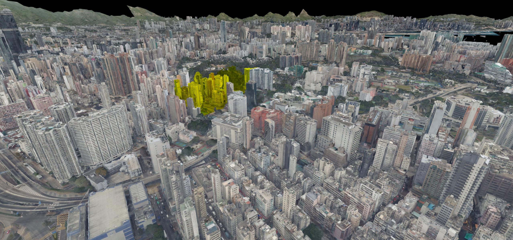
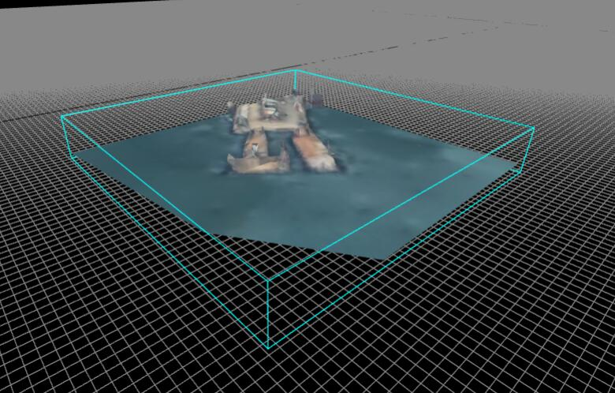
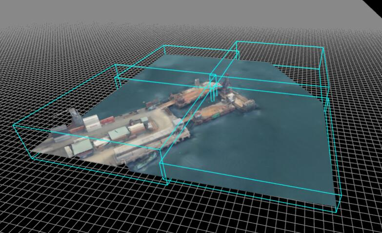
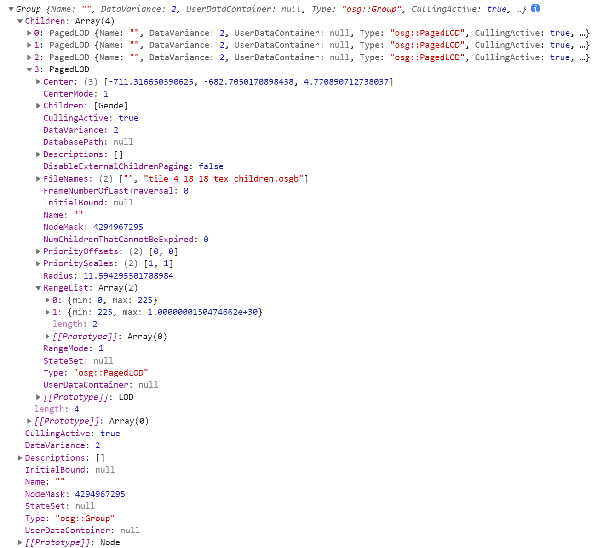

# 如何在Web上直接浏览大规模OSGB格式倾斜模型（三）：实现PagedLOD


在上一篇[《如何在Web上直接浏览大规模OSGB格式倾斜模型（二）：转换OSGB》](https://mp.weixin.qq.com/s?__biz=Mzg2MzY4NTMxNw==&mid=2247483870&idx=1&sn=943b1fefbd3b5fa82829b464898ceead&chksm=ce759e74f902176220c9156b833b14f6422289085bbbcc1ade93df2b33be525d4ff0c1c1d9e8&token=1719636219&lang=zh_CN#rd)中，我们已经实现单个osgb格式模型的转换和显示，本篇我们来实现PagedLOD，加载大规模的模型。

 
在开始之前，先来感受一下我们商业版的性能优势：
##### 解析性能对比：开源版vs商业版
| osgb文件大小 | 开源版耗时        | 商业版耗时       |
|---------|-----------------|---------------- |
| 435 kb  | 4.2451171875 ms | 0.2541503906 ms |
| 0.60 mb | 6.1220703125 ms | 0.5048828125 ms |
| 1.19 mb | 13.790283203 ms | 0.5991210937 ms |
| 1.57 mb | 20.443847656 ms | 0.8320312500 ms |
| 2.64 mb | 33.323974609 ms | 1.1899414062 ms |
> 两个字：快，稳！
> 欢迎咨询，后台回复【商务合作】，获取联系方式！


正文开始了，代码量比较大，`3.1.1`节之后内容，推荐在电脑上阅读。

### 1、认识PagedLOD
简单说，`PagedLOD`可以从`Paged`和`LOD`两方面来认识。

#### 1.1、LOD
首先认识`LOD`，这是一种技术，英文全称是Levels of Detail，意为多细节层次，《地理信息系统名词》第二版，也称为细节层次模型，并给出定义：通过建立原始精细模型的多个近似简化模型，表示原始模型不同程度的细节。三维渲染引擎，根据视点与模型的距离，加载不同简化程度（细节层次）的模型，达到提升渲染效率和浏览体验等目的。

#### 1.2、Paged
然后认识`Paged`，这可以理解“分页的”，强调`LOD`的组织方式，即各个层次的模型的存储和检索，模型文件之间的链接关系。

#### 1.3、PagedLOD
本质上，`PagedLOD`是一颗调度树，可以是四叉树，也可以是八叉树。

如基于数字高程的地形图层则可以用四叉树，将一定空间范围的包围盒，按`一分为四`的方式，逐级细分，这个过程中，可以理解为细分的包围盒高度上始终不变。

而我们研究的倾斜摄影模型数据集，本质上是一个八叉树集合，但并不是严格的八叉树，生成过程大概可以这样理解:
* （1）先将包含数据集内所有点的包围盒，等分为 `x` * `y`个小包围盒，得到`x` * `y`颗八叉树的根节点，这里的`x`和`y`就是我们后面要用的行列号，对每一个根节点进行（2）至（7）步操作;
* （2）用根节点包围盒去裁剪原始模型，得到根节点原始模型；
* （3）对根节点原始模型，进行简化，得到根节点模型；
* （4）将根节点细分（节点包围盒`一分为四`或者`一分为八`）得到子节点，或者仅对原始模型进行简化（节点包围盒不变），这一级的模型比根节点更清晰；
* （5）对第（4）步中生成的子节点进行第（6）至（7）步操作，直到模型的细节（清晰度）与原始模型一致。
* （6）用子节点包围盒去裁剪根节点原始模型，简化，得到子节点模型；
* （7）将子节点细分，或者仅简化节点模型，得到孙节点；




### 2、OSGB倾斜模型文件结构
在开始实现之前，我们结合解析结果来加深对`PagedLOD`的认识和理解。一个倾斜模型osgb文件，可能有两种情况：
* （1）只包含一个LOD节点，解析结果根节点类型就是PagedLOD，这种情况对应根节点或者第`1.3`节（4）、（7）步中节点包围盒不变的情况；
* （2）包含多个LOD节点，对应第`1.3`节（4）、（7）节点细分的情况。
#### 2.1、单个PagedLOD


#### 2.2、多个PagedLOD


#### 2.3、LOD参数

* `Center`和`Radius` 节点包围球，`Center`为中心，`Radius`为半径，可用于视锥裁剪过滤，计算决定是否加载下一细节层次的参数`range`。
* `FileNames` 文件名，第二个为下一层次模型文件名。
* `RangeList` 第一个为当前层次可见的范围，即当`range`大于范围最大值时，加载下一个细节层次的模型。
* `RangeMode` 指示`range`参数计算模式。
    * `0` 表示`range`和`RangeList`中的值是视点到节点中心的距离；
    * `1` 表示`range`和`RangeList`中的值是包围球投影后占屏幕的像素（只是一个估算值）。

### 3、实现PagedLOD
关键步骤：
* （1）从根节点开始，遍历调度树；
* （2）检查是否有下一层次，如有则继续，否则显示当前层次模型并结束遍历；
* （3）计算`range`， 包围球投影，估算占据屏幕像素数；包围球中心到视点的距离；
* （4）如果`range`大于`RangeList[0].max`，检查下一层次是否已经加载；
* （5）如果未加载，则开始请求下一层次模型文件，并显示当前层次模型，结束遍历；
* （6）如果已经加载，则从下一层次开始遍历，重复（2）至（6）；
 
渲染流程： 
* 1.遍历子节点：按其状态分别加入可渲染队列、待加载队列、待转换队列；
* 2.处理可渲染节点：将节点内容包含的3d对象加入渲染队列；
* 3.对待加载列表和待转换列表进行排序；
* 4.处理待转换节点：转换osgb；
* 5.处理待加载节点：加载、解析osgb；
* 6.内存管理：当估算的内存占用超过阈值时，卸载过期瓦片。

实现效果（three.js版）:
<p>
    <video style="max-width:100%" id="video" controls="" preload="none" poster="图1.jpg">
        <source id="mp4"  src="效果视频.mp4" poster="" type="video/mp4">
    </video>
</p>

#### 3.1、接口定义
* `LOD类` 封装基本的计算功能，包括包围球投影，距离，视锥裁剪等。
* `PagedLOD类` 封装当前层次的模型创建、显示等功能，并根据`RangeList`和`FileNames`创建下一层次节点（类型为`PagedLODSet`）。
* `PagedLODSet类` 封装osgb文件读取、解析、创建当前层次的节点（类型为PagedLOD），渲染，射线查询，创建并导出索引等功能。
* `PagedLODQueue类` 封装排队功能，包含入队，出队，排序等。
* `PagedLODContent类` 负责转换osgb，创建并提供节点模型3D对象。

##### 3.1.1、PagedLODSet类
构造函数参数解释：
* `url` 数据集路径，可以是：
    * metadata.xml路径
    * 索引文件index.json路径
    * metadata.xml或者index.json所在文件夹路径，优先尝试加载index.json，不存在则自动加载metadata.xml
    * osgb模型文件，单个模型LOD
* `lodScale` LOD缩放倍数，同一视野下，倍数越大，显示的瓦片分辨率越低，同时渲染的瓦片越少
* `maxMemeory` 当估算的内存占用（单位为byte）超过该值时，卸载过期瓦片。默认为 1024 * 1024 * 500
* `maxRequest` 最大并发请求数量，如果当前请求数量超过该值，则当前帧不发出新的请求。默认为 4
* `maxParsing` 最大转换任务数量，如果当前未完成转换的任务数量大于等于该值，则当前帧不启动新的转换任务.默认为 1
* `domains` 负载均衡数据服务节点列表。url中节点模板标记为`{t}`，即url形如：http://{t}.ds.mesh-3d.com
* `pendingSortFunc` 自定义排队函数，用于对待请求和待转换瓦片队列的排序。对排队结果的应用：越靠前越早被处理（请求、解析数据或转换osgb）
* `onInitProgress` 初始化进度回调函数，仅数据集没有创建索引文件index.json时有用，因为此情况下需要按给定的行列号范围，逐个尝试猜测的根节点文件是否存在，耗时比较长
* `grid` 入口文件为 metadata.xml 时，需指定行列号范围（minX/Y,maxX/Y），数据目录相对路径等信息
    * `minX` 最小列号，默认为 0 
    * `maxX` 最大列号，默认为 8  
    * `minY` 最小行号，默认为 0 
    * `maxY` 最大行号，默认为 8   
    * `dataDir` 数据目录相对路径，相对于metadata.xml或者index.json所在文件夹，默认为'/Data'
    * `tilePattern` 瓦片文件名（不包含后缀）模板，默认为'Tile_{x}_{y}' 
    * `ext` 瓦片文件后缀，默认为'osgb'
* `proxy` 代理，可选
`debugVolume` true则创建并显示调试线框（瓦片包围盒）
`debugVolumeOnly` true则仅显示调试线框

```TypeScript
export class PagedLODSet extends LOD { 
    constructor(options: {
        url: string
        manager?: THREE.LoadingManager 
        lodScale?: number 
        maxMemeory?: number 
        maxRequest?: number 
        maxParsing?: number
 
        grid?: { 
            minX: number 
            maxX: number 
            minY: number 
            maxY: number 
            dataDir?:string 
            tilePattern?:string 
            ext?:string
        }
      
        domains?: string[]
        visible?: boolean
        proxy?: { getUrl: (url: string) => string }
        
        pendingSortFunc?: (a: PagedLOD | PagedLODSet, b: PagedLOD | PagedLODSet) => number 
        onInitProgress?: (progress: number) => void
 
        debugVolume?: boolean
        debugVolumeOnly?: boolean
    })

    readonly domains?: string[]
    readonly ready: boolean
    readonly readyPromise: Promise<this>
    readonly children: (PagedLOD | PagedLODSet)[]
    readonly url: string
    readonly path: string
    readonly metadata: {
        srs: string,
        enuOrigin: number[]
        srsOrigin: number[]
        upAxis: 'y' | 'z'
        [key: string]: any
    }
    readonly manager: THREE.LoadingManager
    readonly memeory: number
    readonly queue: PagedLODQueue

    visible: boolean
    transform: THREE.Matrix4 
    lodScale: number 
    maxMemeory: number 
    maxRequest: number 
    maxParsing: number

    grid: {
        minX: number
        maxX: number
        minY: number
        maxY: number
    }

    debugVolume: boolean
    debugVolumeOnly: boolean
 
    pendingSortFunc?: (a: PagedLOD | PagedLODSet, b: PagedLOD | PagedLODSet) => number 
    onInitProgress?: (progress: number) => void

    /**
     * 请求文件数据，解析，创建子节点。注意：这里尚未进行转换，并不能在完成后获取3d对象
     * @returns {Promise<this>}
     */
    load(): Promise<this>

    /**
     * 遍历LOD树，按节点状态加入不同的队列
     * @param {{
     *     camera:THREE.PerspectiveCamera 
     *     renderer:THREE.WebGLRenderer
     *     frustum:THREE.Frustum,
     *     frameNumber: number
     * }} frameState 
     * @param {PagedLODQueue} queue 
     * @returns {boolean}
     */
    traverse(
        frameState: {
            camera: THREE.PerspectiveCamera
            renderer: THREE.WebGLRenderer
            frustum: THREE.Frustum,
            frameNumber: number
        },
        queue: PagedLODQueue
    ): boolean


    /**
     * 渲染程序入口，每一帧渲染前调用，通知内部遍历获取可渲染节点的3d对象，加入渲染队列`renderList`。调用者需要自行创建、传递、处理渲染队列`renderList`，完成最终的渲染。
     * @param {{
     *     camera:THREE.PerspectiveCamera 
     *     renderer:THREE.WebGLRenderer
     *     frustum:THREE.Frustum,
     *     frameNumber: number
     * }} frameState 
     * @param {THREE.Object3D[]} renderList  
     */
    onRender(
        frameState: {
            camera: THREE.PerspectiveCamera
            renderer: THREE.WebGLRenderer
            frustum: THREE.Frustum,
            frameNumber: number
        },
        renderList: THREE.Object3D[]
    ): void

    /**
     * 射线查询，可用于交互拾取对象
     * @param {THREE.Raycaster} raycaster 
     * @param {THREE.Intersection[]} [intersects] 
     */
    raycast(raycaster: THREE.Raycaster, intersects?: THREE.Intersection[]): THREE.Intersection[]

    /**
     * 导出索引
     * @returns {object}
     */
    toJSON(): object

    /**
     * 卸载所有瓦片，释放资源
     */
    destroy(): void

}
```

##### 3.1.2、LOD类
```TypeScript
export class LOD {

    constructor(options: {
        parent?: LOD
        tileset?: LOD
        boundingSphere?: THREE.Sphere
        boundingBox?: THREE.Box3
        rangeMode?: 0 | 1
    })
    
    readonly range: number
    readonly children: LOD[]
    
    readonly parent?: LOD
    readonly tileset?: LOD
    readonly boundingBox?: THREE.Box3
    readonly boundingSphere?: THREE.Sphere
    readonly distanceToCamera: number
    readonly visibility: number
    readonly isDestroyed: boolean

    isExpired: boolean

    computeVisibility(frameState: {
        camera: THREE.PerspectiveCamera
        renderer: THREE.WebGLRenderer
        frustum: THREE.Frustum,
        frameNumber: number
    }): void

    traverse(frameState: {
        camera: THREE.PerspectiveCamera
        renderer: THREE.WebGLRenderer
        frustum: THREE.Frustum,
        frameNumber: number
    }): void

    destroy(): void

}
```

##### 3.1.3、PagedLOD类
```JavaScript
export class PagedLOD extends LOD {
    constructor(options: {
        content: Object
        url: string
        parent?: OSGLikeLOD
        tileset?: OSGLikeLOD
        boundingSphere?: THREE.Sphere
        boundingBox?: THREE.Box3
        rangeMode?: 0 | 1
    })

    readonly url: string
    readonly path: string 
    readonly level: number

    readonly rangeDataList: string[]
    readonly rangeList: { min: number, max: number }[] 
    readonly maxRange: number
    readonly rangeMode: 0 | 1

    readonly userCenter: {
        center: number[]
        radius: number
    }

    readonly content: PagedLODContent
    readonly children: PagedLODSet[]

    /**
     * 
     * @param {Osg.PagedLOD|Osg.Geometry|Osg.Geode} content 
     */
    init(content: object): void

    /**
     * 
     * @param {{
     *     camera:THREE.PerspectiveCamera 
     *     renderer:THREE.WebGLRenderer
     *     frustum:THREE.Frustum,
     *     frameNumber: number
     * }} frameState 
     * @param {PagedLODQueue} queue 
     * @returns {boolean}
     */
    traverse(
        frameState: {
            camera: THREE.PerspectiveCamera
            renderer: THREE.WebGLRenderer
            frustum: THREE.Frustum,
            frameNumber: number
        },
        queue: PagedLODQueue
    ): boolean

    unload(): void

    destroy(): void
}
```

##### 3.1.4、PagedLODContent类
```TypeScript
/**
 * 负责LOD节点模型转换和渲染
 */
export class PagedLODContent {

    constructor(options: {
        osgObject: osg.PagedLOD | osg.Geode | Osg.Geometry | osg.Group
        manager: THREE.LoadingManager
        debugVolume?: boolean
        debugVolumeOnly?: boolean
    })
    model: THREE.Object3D
    debugVolume: boolean
    debugVolumeOnly: boolean
    memeory: number
    transform: THREE.Matrix4
    readonly isDestroyed: boolean

    /**
     * 
     * @param {{
     *     camera:THREE.PerspectiveCamera 
     *     renderer:THREE.WebGLRenderer
     *     frustum:THREE.Frustum,
     *     frameNumber: number
     * }} frameState 
     * @param {THREE.Object3D[]} renderList  
     */
    onRender(
        frameState: {
            camera: THREE.PerspectiveCamera
            renderer: THREE.WebGLRenderer
            frustum: THREE.Frustum,
            frameNumber: number
        },
        renderList: THREE.Object3D[]
    ): void

    parse(): Promise<this>

    destroy(): void
}

```

下面贴出关键代码，都是从可运行的源码中直接复制过来的，可以说比较详尽了，希望对你动手实现有帮助。
 
#### 3.2、包围球投影
```JavaScript
var _vector3=new THREE.Vector3()
/**
 *  from http://www.iquilezles.org/www/articles/sphereproj/sphereproj.htm
 *  Sample code at http://www.shadertoy.com/view/XdBGzd?
 * @param {THREE.Sphere} sph 
 * @param {THREE.Matrix4} camMatrix 
 * @param {number} fle 
 * @returns 
 */
function projectBoundingSphere(sph, camMatrix, fle) {
    var o = _vector3.copy(sph.center).applyMatrix4(camMatrix)
    var r = sph.radius
    var r2 = r * r
    var z2 = o.z * o.z;
    var l2 = o.dot(o);
    var area =
        -Math.PI *
        fle *
        fle *
        r2 *
        Math.sqrt(Math.abs((l2 - r2) / (r2 - z2))) /
        (r2 - z2);
    return area;
}
```

#### 3.3、LOD计算range
```JavaScript
  computeVisibility(frameState) {
        const { camera, frustum } = frameState;
        const boundingSphere = this.boundingSphere;
        if (boundingSphere) {
            const visible = frustum.intersectsSphere(boundingSphere)
            this.visibility = visible ? 1 : 0;
            var distanceToCamera = boundingSphere.distanceToPoint(camera.position)
            if (distanceToCamera < 0) {//相机位置在包围球里面
                distanceToCamera = 0;
            }
            this.distanceToCamera = distanceToCamera;
        } else {
            this.visibility = 1;
            this.distanceToCamera = 0
        }
    }

    traverse(frameState) {
        const { camera, renderer } = frameState;
        const { tileset, boundingSphere, rangeMode } = this;
        const { lodScale, transform } = tileset
        const { Matrix4, Vector3, Vector4 } = THREE

        if (!_vector3) _vector3 = new Vector3()
        if (!_viewport) _viewport = new Vector4()
        if (!_matrix4) _matrix4 = new Matrix4();

        this.computeVisibility(frameState);

        // Calculate distance from viewpoint 
        if (rangeMode == 0) {
            this.range = this.distanceToCamera * lodScale
        }
        else if (this.visibility) {
            // Calculate pixels on screen
            var modelMatrix = transform;
            var viewMatrix = camera.matrixWorldInverse
            var projmatrix = camera.projectionMatrix
            var modelViewMatrix = _matrix4.multiplyMatrices(modelMatrix, viewMatrix)
            var requiredRange = projectBoundingSphere(boundingSphere, modelViewMatrix, projmatrix.elements[0])
            // Get the real area value and apply LODScale
            var viewport = renderer.getViewport(_viewport)
            requiredRange = requiredRange *
                viewport.width *
                // viewport.width *
                viewport.height *
                0.25 /
                lodScale;

            this.range = requiredRange;
        }

    }
```

#### 3.4、PagedLOD初始化
```JavaScript
init(content) {
    const { rangeDataList, rangeList, userCenter, path, tileset } = this;
    const { manager, debugVolume, debugVolumeOnly, transform } = tileset;
    const { Euler, Quaternion, Sphere } = THREE;

    if (rangeDataList && rangeDataList.length > 0
        && !this.children.length//过期节点重新加载时，不创建子节点
    ) {
  
        if (!_zUp2YupQuat) {
            const zUp2YupEuler = new Euler(-Math.PI / 2)
            _zUp2YupQuat = new Quaternion().setFromEuler(zUp2YupEuler)
        }

        var boundingSphere = this.boundingSphere || new Sphere();
        boundingSphere.center.fromArray(userCenter.center)
        boundingSphere.radius = userCenter.radius
        boundingSphere.center.applyQuaternion(_zUp2YupQuat)
        this.boundingSphere = boundingSphere

        this.maxRange = rangeList[0].max

        for (let i = 1; i < rangeDataList.length; i++) {
            const rangeData = rangeDataList[i];
            var childLODSet = new PagedLODSet({
                parent: this,
                url: path + '/' + rangeData,
                tileset,
                level: this.level + 1
            })
            this.children.push(childLODSet)
        }
    }

    this.content = new PagedLODContent({
        osgObject: content,
        manager,
        transform,
        debugVolume,
        debugVolumeOnly
    });
    if (debugVolume) {
        this.boundingBox = this.content.boundingBox
    }

}
```

#### 3.4、PagedLOD遍历
```JavaScript
traverse(frameState, queue) {

    const { rangeDataList, content, maxRange } = this;
    /**
     * 1.视锥裁剪过滤
     * 2.根据相机、包围球以及范围计算模式，估算LOD范围（range）
     * 注意：叶子节点没有包围球，无需进行裁剪过滤
     */
    if (this.boundingSphere) {
        super.traverse(frameState)
        if (!this.visibility) {
            return true;
        }
    }

    //记录最新访问的帧数，用于判断是否过期（可卸载）
    this.frameNumber = frameState.frameNumber;

    //根据LOD范围（range），遍历下一细节层级
    if (rangeDataList && rangeDataList.length > 1) {

        let requiredRange = this.range;
        if (requiredRange < 0) {
            requiredRange = maxRange
        }

        if (requiredRange >= maxRange) {
            var child = this.children[0]
            var ready = child.traverse(frameState, queue);
            if (ready) {
                return true
            }
        }
    }

    //将当前节点加入渲染队列（queue.rendering）或者待转换队列（queue.parsing）。
    //注意：不处理过期节点
    if (!this.isExpired) {
        if (content && content.ready) {
            queue.pushRendering(this)
            return true
        } else {
            queue.pushParsing(this)
        }
    }

}
```
 
#### 3.5、PagedLODSet初始化
创建或者更新子节点
```JavaScript
function initLODGroup(lodset, content) {
    const url = lodset.url;
    var osgPagedLODs = content.Children

    if (content.Type == 'osg::PagedLOD') {
        osgPagedLODs = [content]
    } else if (!content.Children) {
        lodset.isEmpty = true;
        return;
    }

    if (lodset.children.length) {//卸载过的瓦片，重新加载时不需要创建新子节点

        if(osgPagedLODs.length>1){
            console.log(content);
        }
        lodset.isExpired = false
        for (let i = 0; i < osgPagedLODs.length; i++) {
            const osgPagedLOD = osgPagedLODs[i];
            var childLOD = lodset.children[i]
            childLOD.init(osgPagedLOD)
            childLOD.isExpired = false
        }

    } else {//瓦片首次加载，创建子节点

        for (let i = 0; i < osgPagedLODs.length; i++) {
            const osgPagedLOD = osgPagedLODs[i];
            var childLOD, childUri = [url, i].join('.');

            childLOD = new PagedLOD({
                parent: lodset,
                url: childUri,
                content: osgPagedLOD,
                tileset: lodset.tileset || lodset,
                level: lodset.level + 1
            })

            lodset.children.push(childLOD)
        }
    }

}

```

#### 3.6、PagedLODSet遍历
```JavaScript 
traverse(frameState, queue) {
    const { frustum } = frameState;
    const { isLoading, level } = this;

    //计算瓦片可见性，以及瓦片到相机位置的距离
    this.computeVisibility(frameState)
    if (level == 0 && !this.visibility) {
        return true
    }

    //记录最新访问的帧数，用于判断是否过期（可卸载）
    this.frameNumber = frameState.frameNumber;

    if (isLoading) {
        return false;
    }

    if (!this.loaded) {//加载当前节点
        queue.pushLoading(this);
        return false;

    } else if (this.isExpired) {  //判断是否需要重新加载过期的节点
        var needReload = false
        for (const lod of this.children) {
            if (lod.boundingSphere) {
                needReload = frustum.intersectsSphere(lod.boundingSphere)
            } else {
                needReload = true
            }
            if (needReload) {
                break;
            }
        }

        if (needReload) {
            for (const lod of this.children) {
                lod.frameNumber = this.frameNumber
            }
            queue.pushLoading(this);
            return false;
        } else {
            return true
        }

    } else {//遍历子节点

        var childrenLoaded = true
        const children = this.children;
        for (let i = 0, l = children.length; i < l; i++) {
            const childLOD = children[i];
            var childReady = childLOD.traverse(frameState, queue)
            if (!childReady) {
                childrenLoaded = false
                //注意：这里不要break，break则部分子节点没有检查状态就被丢弃了，永远访问不了下一层级
            }
        }

        return childrenLoaded
    }

}
```

##### 3.7、PagedLODSet渲染程序入口
```JavaScript 
onRender(frameState, renderList) {
    if (this.isDestroyed || !this.visible) return;

    /**
     * @type {PagedLODQueue}
     */
    const queue = this.queue;
    queue.init(frameState.frameNumber)

    //1.遍历子节点，按其状态分别加入可渲染队列、待加载队列、待转换队列
    this.traverse(frameState, queue);

    //2.处理可渲染节点：将节点内容包含的3d对象加入渲染队列
    for (const lodRendering of queue.rendering) {
        if (lodRendering.content) {
            lodRendering.content.onRender(frameState, renderList)
        }
    }

    //3.对待加载列表和待转换列表进行排序
    queue.sortPending(this.pendingSortFunc)

    //4.处理待转换节点：转换osgb 
    while (queue.numParsing
        && this._numParsing < this.maxParsing
    ) {
        var lodParsing = queue.shiftParsing()
        lodParsing.content.parse().then(() => {
            if (!lodParsing.isExpired) {
                this.memeory += lodParsing.content.memeory;
            }
            this._numParsing--
        }).catch(err => {
            this._numParsing--
        })
        this._numParsing++
    }

    //5.处理待加载节点：加载、解析osgb  
    while (queue.numLoading
        && this._numLoading < this.maxRequest
    ) {
        var lodLoading = queue.shiftLoading()
        lodLoading.load().then(() => {
            this._numLoading--
        }).catch(err => {
            this._numLoading--
        })
        this._numLoading++
    }

    //6.内存管理：当估算的内存占用超过阈值时，卸载过期瓦片
    if (this.memeory >= this.maxMemeory) {

        var expiredList = queue.getExpiredList();
        var minMemeory = this.maxMemeory * 0.25;

        while (expiredList.length && this.memeory >= minMemeory) {
            var expiredLodset = expiredList.shift()
            var expiredLods = expiredLodset.children
            expiredLodset.isExpired = true

            for (let i = 0, l = expiredLods.length; i < l; i++) {
                const expiredLod = expiredLods[i];
                if (expiredLod.content) {
                    var mem = expiredLod.content.memeory
                    expiredLod.unload()
                    expiredLod.isExpired = true
                    this.memeory -= mem
                }
            }
        }
    }

}
```

至此，《如何在Web上直接浏览大规模OSGB格式倾斜模型》系列完结。

### 欢迎关注微信公众号【三维网格3D】，第一时间获取最新文章 ###
